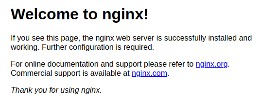

# Instalación de nginx.

En primer lugar debemos asegurarnos de que no hay otro servidor web instalado en el sistema.

Los pasos para la desinstalación de Apache (si estuviera instalado) Para Ubuntu 20.04 son:

```bash
sudo apt remove apache2 -y
```

y para CentOS 9:

```bash
sudo dnf remove httpd -y
```

También es conveniente borrar la caché del navegador para que no nos confunda.


Para instalar Nginx en Ubuntu 20.04 y CentOS 9, primero necesitarás acceso a una terminal en tu sistema. A continuación, te mostraré los pasos detallados para cada distribución:

## Instalación en Ubuntu 20.04:

1. **Actualizar los paquetes del sistema:**
   Antes de instalar cualquier nuevo software, es recomendable actualizar el índice de paquetes y actualizar los paquetes existentes. Podemos hacerlo ejecutando los siguientes comandos en la terminal:

   ```bash
   sudo apt update -y
   ```

   ```
   sudo apt upgrade -y
   ```

2. **Instalar Nginx:**
   Una vez que el sistema esté actualizado, podemos instalar Nginx ejecutando el siguiente comando:

   ```bash
   sudo apt install nginx -y
   ```

3. **Comprobar el estado de Nginx:**
   Después de la instalación, puedes verificar el estado de Nginx para asegurarte de que se haya instalado correctamente y esté en funcionamiento:

   ```bash
   sudo systemctl status nginx
   ```

4. **Configuración del cortafuegos (si es necesario):**
   Si estmos utilizando un cortafuegos en tu servidor, como `UFW`, necesitaremos asegurarnos de que el tráfico HTTP esté permitido. podemos hacerlo ejecutando el siguiente comando:

   ```bash
   sudo ufw allow 'Nginx HTTP'
   ```

5. **Acceder al servidor web:**
   Una vez completados los pasos anteriores, abrimos un navegador web y probamos.

   ```
   http://localhost
   ```

   Debe aparecer la página por defecto de `nginx`

   

## Instalación en CentOS 9:

1. **Actualizar los paquetes del sistema:**
   Al igual que en Ubuntu, es recomendable actualizar los paquetes del sistema antes de instalar nuevos software. Ejecutamos los siguientes comandos en la terminal:

   ```bash
   sudo dnf update -y
   ```

2. **Instalar Nginx:**
   Después de actualizar, podemos instalar Nginx ejecutando el siguiente comando:

   ```bash
   sudo dnf install nginx -y
   ```

3. **Comprobar el estado de Nginx:**
   Una vez instalado, verificamos el estado de Nginx para asegurarnos de que esté en funcionamiento:

   ```bash
   sudo systemctl status nginx -y
   ```

4. **Configuración del cortafuegos (si es necesario):**
   Si estás utilizando `Firewalld` u otro cortafuegos en tu servidor, asegúrate de permitir el tráfico HTTP. Podemos hacerlo ejecutando el siguiente comando:

   ```bash
   sudo firewall-cmd --permanent --add-service=http
   ```

   ```
   sudo firewall-cmd --reload
   ```

5. **Acceder al servidor web:**
   Una vez configurado, abrimos un navegador web y probamos.

   ```
   http://localhost
   ```
   
   Debe aparecer la página por defecto de `nginx`
   
   


[Vamos al siguiente contenido](./10-C.md)
