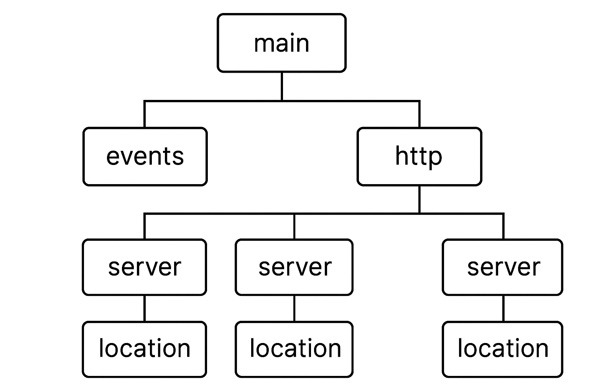
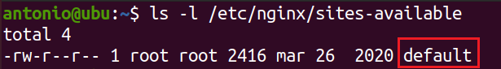
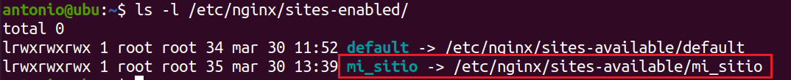

# Configuración básica de Nginx.


El archivo de configuración de Nginx puede describirse como una `lista de directivas` organizadas en una estructura lógica. El comportamiento completo de la aplicación está definido por los valores que asignamos a esas directivas.

Por defecto, Nginx hace uso de un único archivo de configuración principal, que se ubica en `/etc/nginx/nginx.conf`. 

El archivo de configuración de Nginx sigue una estructura modular, donde cada bloque (seccion, etc.) de configuración está delimitado por llaves `{` `}`. Dentro de estos bloques, se definen directivas que especifican la configuración del servidor web. 

Las directivas tienen la forma `directiva valor;`, donde `directiva` es el nombre de la configuración que se desea establecer y `valor` es el valor asignado a esa configuración.

** Los bloques o secciones se consideran directivas que agrupan otras directivas** : Sirven para categorizar/organizar el tipo de configuración a la que hacen referencia.

Los comentarios en el archivo de configuración comienzan con el símbolo `#` y pueden ser útiles para documentar la configuración o desactivar temporalmente partes del archivo.

Este es el archivo de configuración de una instalación por defecto de Nginx. Estúdialo.

```nginx
user www-data;
worker_processes auto;
pid /run/nginx.pid;
include /etc/nginx/modules-enabled/*.conf;

events {
        worker_connections 768;
        # multi_accept on;
}

http {

        ##
        # Basic Settings
        ##

        sendfile on;
        tcp_nopush on;
        tcp_nodelay on;
        keepalive_timeout 65;
        types_hash_max_size 2048;
        # server_tokens off;

        # server_names_hash_bucket_size 64;
        # server_name_in_redirect off;

        include /etc/nginx/mime.types;
        default_type application/octet-stream;
      ##
        # SSL Settings
        ##

        ssl_protocols TLSv1 TLSv1.1 TLSv1.2 TLSv1.3; # Dropping SSLv3, ref: POODLE
        ssl_prefer_server_ciphers on;

        ##
        # Logging Settings
        ##

        access_log /var/log/nginx/access.log;
        error_log /var/log/nginx/error.log;

        ##
        # Gzip Settings
        ##

        gzip on;

        # gzip_vary on;
        # gzip_proxied any;
        # gzip_comp_level 6;
        # gzip_buffers 16 8k;
        # gzip_http_version 1.1;
        
        ##
        # SSL Settings
        ##

        ssl_protocols TLSv1 TLSv1.1 TLSv1.2 TLSv1.3; # Dropping SSLv3, ref: POODLE
        ssl_prefer_server_ciphers on;

        ##
        # Logging Settings
        ##

        access_log /var/log/nginx/access.log;
        error_log /var/log/nginx/error.log;

        ##
        # Gzip Settings
        ##

        gzip on;

        # gzip_vary on;
        # gzip_proxied any;
        # gzip_comp_level 6;
        # gzip_buffers 16 8k;
        # gzip_http_version 1.1;
  
        ##
        # Virtual Host Configs
        ##

        include /etc/nginx/conf.d/*.conf;
        include /etc/nginx/sites-enabled/*;

#mail {
#       # See sample authentication script at:
#       # http://wiki.nginx.org/ImapAuthenticateWithApachePhpScript
# 
#       # auth_http localhost/auth.php;
#       # pop3_capabilities "TOP" "USER";
#       # imap_capabilities "IMAP4rev1" "UIDPLUS";
# 
#       server {
#               listen     localhost:110;
#               protocol   pop3;
#               proxy      on;
#       }
# 
#       server {
#               listen     localhost:143;
#               protocol   imap;
#               proxy      on;
#       }
#}
```
## Directivas del núcleo de Nginx y directivas que dependen de módulos adicionales

En Nginx, muchas de las directivas básicas que necesitas para configurar el servidor **no dependen de módulos adicionales**, sino que forman parte del **núcleo (core)** de Nginx.

Estas directivas del núcleo están **siempre disponibles**, sin importar qué módulos tengas activados, porque vienen incorporadas en el binario principal de Nginx.

---

## Directivas más importantes que pertenecen al núcleo de Nginx

### 1. **Directivas generales (fuera de bloques)**
```
main <===================
 ├── events
 └── http
      ├── server
      │     └── location
      ├── server
      │     └── location
      └── server
            └── location
```
---

* `worker_processes`
* `worker_connections`
* `pid`
* `error_log`
* `events` (bloque)
* `http` (bloque)
* `include`
* `daemon`
* `user`
* `env`

Estas controlan **el comportamiento global del servidor**, como la cantidad de procesos, archivos de logs o la lectura de archivos externos.

---

### 2. **Bloque `events`**

```
main
 ├── events <=============
 └── http
      ├── server
      │     └── location
      ├── server
      │     └── location
      └── server
            └── location
```
---

* `worker_connections`
  (cuántas conexiones puede manejar cada proceso)
* `multi_accept`
  (acepta varias conexiones en una sola llamada)
* `use epoll` / `use kqueue`
  (define el método de manejo de eventos según el sistema operativo)

Estas directivas controlan el **manejo interno de las conexiones TCP**.

---

### 3. **Bloque `http` y sub-bloques `server`, `location`**
---
```
main 
 ├── events
 └── http <=================== 
      ├── server
      │     └── location
      ├── server
      │     └── location
      └── server
            └── location
```
---

Dentro del bloque `http` también hay muchas directivas del núcleo:

* `server`
* `listen`
* `location`
* `server_name`
* `root`
* `index`
* `access_log`
* `error_log`
* `return`
* `rewrite`
* `try_files`
* `limit_except`
* `client_max_body_size`
* `sendfile`
* `tcp_nopush`
* `tcp_nodelay`
* `keepalive_timeout`
* `default_type`
* `types_hash_max_size`

Estas controlan **la forma en que Nginx responde a las solicitudes HTTP** y cómo gestiona el contenido.

---

### 4. **Variables y flujo de control**

* `set`
* `if`
* `break`
* `return`
* `rewrite`
* `try_files`

Estas permiten **controlar el flujo de ejecución** dentro de una configuración (aunque el uso de `if` debe manejarse con cuidado).

---

#### DE NUEVO: Las directivas del núcleo son las que:

* Siempre están disponibles.
* No requieren módulos externos.
* Permiten configurar lo esencial del funcionamiento de Nginx.

---
---

## `user www-data;` - Usuario sobre el que se ejecutarán los procesos de Nginx

El usuario `www-data` es el nombre comúnmente utilizado para el usuario del sistema bajo el cual se ejecutan los procesos del servidor web. Este usuario se utiliza para limitar los privilegios y reforzar la seguridad del servidor.

Cuando Nginx se inicia, los procesos del servidor web se ejecutan bajo el contexto del usuario `www-data`. Esto significa que el servidor web tiene acceso limitado a los recursos del sistema y solo puede realizar las acciones permitidas para ese usuari y se reduce el riesgo de que un atacante pueda comprometer el sistema a través de vulnerabilidades en el servidor web, ya que los procesos del servidor se ejecutan con un conjunto mínimo de privilegios.

## `worker_processes auto;` 

Es una directiva del archivo de configuración principal de Nginx (`nginx.conf`) que **indica cuántos procesos "worker" debe lanzar el servidor web** para manejar las conexiones de los usuarios.

En Nginx hay dos tipos de procesos:

1. **Master process**: el jefe. Se encarga de leer la configuración y lanzar los procesos "worker".
2. **Worker processes**: los que hacen el trabajo real. Atienden las peticiones HTTP, leen archivos, devuelven respuestas, etc.

---

### ¿Qué hace `worker_processes auto;`?

Cuando se indica:

```nginx
worker_processes auto;
```

Se está diciendo a Nginx:
**"Detecta automáticamente cuántos núcleos de CPU tiene el servidor y crea un proceso worker por cada núcleo."**

---

### ¿Por qué se hace así?

Porque:

* Cada proceso worker puede usar **un solo núcleo de CPU**.
* Si tienes, por ejemplo, 4 núcleos y solo lanzas 1 proceso, estás desaprovechando los otros 3.
* Si lanzas 4 procesos en una máquina con 4 núcleos, **puedes manejar más conexiones en paralelo** y aprovechar al máximo el hardware.

`auto` es una forma **inteligente y práctica** de decirle a Nginx:

> “Haz lo correcto según el sistema donde estés instalado.”

---

### Ejemplo práctico

* En un servidor con 8 núcleos de CPU:

  ```nginx
  worker_processes auto;
  ```

  se convierte internamente en:

  ```nginx
  worker_processes 8;
  ```

---

### ¿Cuándo no usar `auto`?

Solo en casos muy específicos, como:

* Servidores virtuales con núcleos compartidos.
* Necesidades de limitar el uso de CPU por razones de recursos o rendimiento.
* Escenarios de pruebas o depuración donde se desea un solo proceso.

Pero para el 99% de los casos reales (producción o desarrollo), **`auto` es la mejor opción**.


---

## `pid /run/nginx.pid;`

La directiva `pid` indica **dónde debe guardar Nginx el número de identificación del proceso maestro (PID)** cuando se inicia.

* PID significa **Process ID** (identificador de proceso).
* Es un número único que asigna el sistema operativo a cada proceso que se ejecuta.
* En el caso de Nginx, el **proceso maestro** (el que gestiona a los "workers") tiene su propio PID.

---

### ¿Por qué se guarda el PID en un archivo?

Porque otras herramientas o comandos del sistema **necesitan saber cuál es ese número** para poder:

* Reiniciar Nginx.
* Detenerlo.
* Recargar su configuración.
* Supervisarlo desde un sistema de monitoreo.

Al guardar el PID en un archivo (por ejemplo, `/run/nginx.pid`), otras aplicaciones o scripts pueden leerlo fácilmente.

* `/run` es un directorio temporal del sistema (en Linux) que guarda archivos de procesos en ejecución.
* Es común que los servicios coloquen ahí sus archivos `.pid` para seguir buenas prácticas del sistema.


Si no se incluye esta línea, Nginx usará una **ubicación por defecto**, que suele ser:

```plaintext
/usr/local/nginx/logs/nginx.pid
```
Aunque puede variar según cómo y dónde se haya instalado Nginx.

---

### No es buena idea cambiar la ubicación del archivo pid en algunos sistemas

Claro. Cambiar la ruta del archivo PID de:

```nginx
pid /run/nginx.pid;
```

a otra ubicación

**puede dar problemas por varias razones**, todas relacionadas con cómo el sistema operativo y los scripts de administración esperan encontrar ese archivo.

---

#### 1. **Los scripts del sistema esperan `/run/nginx.pid`**

* Cuando usas comandos como `systemctl reload nginx` o `service nginx restart`, el sistema **busca automáticamente el archivo de PID en la ubicación estándar** (`/run/nginx.pid`).
* Si cambias la ruta a `/run/nginx2.pid`, esos comandos **ya no encuentran el proceso de Nginx** porque no saben que debe mirar en otro sitio.

Resultado:
**Los comandos fallan o no afectan al proceso real de Nginx.**

---

#### 2. **Permisos y existencia del directorio `/run`**

* `/run` es un directorio temporal que **se crea en cada arranque** del sistema.
* Si creas un nombre de archivo personalizado como `/run/nginx2.pid`, y no existe o no tiene permisos correctos (por ejemplo, por el cambio de usuario), Nginx **no podrá escribir su PID ahí**.

Resultado:
**Nginx no arranca o lanza un error al iniciar.**

---

#### 3. **Otros servicios pueden depender del PID original**

* Herramientas de monitoreo, paneles de control, firewalls o scripts personalizados pueden tener referencias internas a `/run/nginx.pid`.
* Al cambiar el nombre, **rompes esas dependencias**, lo que puede causar fallos inesperados.

---

## `include /etc/nginx/modules-enabled/*.conf;`

La directiva `include` **es una directiva del nucleo** simplemente le dice a Nginx:

> “Inserta el contenido de estos archivos aquí como si estuviera escrito directamente en este punto del archivo de configuración.”

Es una herramienta de organización: **divide el archivo de configuración en partes más pequeñas y manejables**.

---

### ¿En qué contexto se puede usar?

Puedes usar `include` en cualquier bloque de configuración de Nginx:

* Fuera de todo (nivel raíz en `nginx.conf`)
* Dentro del bloque `http { }`
* Dentro de `server { }`
* Incluso dentro de `location { }`, aunque es menos común

---

## Ejemplo práctico

```nginx
http {
    include /etc/nginx/mime.types;
    include /etc/nginx/conf.d/*.conf;
}
```
---
---

## `events { ... }`

```
main 
 ├── events <============
 └── http
      ├── server
      │     └── location
      ├── server
      │     └── location
      └── server
            └── location
```

Define configuraciones relacionadas con los eventos de Nginx, en este caso se eslablece el número máximo de conexiones de los workers (`worker_connections`) en 768 conexiones. Es importante ajustar este valor según la capacidad del servidor y la carga de trabajo esperada. Si hay demasiadas conexiones simultáneas para el servidor, algunas solicitudes pueden ser rechazadas o experimentar tiempos de espera.


### `worker_connections`

Es una directiva que se configura dentro del bloque `events {}` en el archivo `nginx.conf` y que **define cuántas conexiones simultáneas puede manejar un solo proceso de trabajo (worker)** de Nginx.

---

## ¿Dónde se declara?

```nginx
events {
    worker_connections 1024;
}
```

Este ejemplo indica que **cada worker puede gestionar hasta 1024 conexiones activas al mismo tiempo**.

---

## ¿Cómo funciona?

Nginx lanza uno o varios procesos *worker* (según la directiva `worker_processes`).
Cada uno de estos procesos tiene un límite de conexiones activas definido por `worker_connections`.

### Fórmula total de conexiones posibles:

```
conexiones_totales = worker_processes × worker_connections
```

**Ejemplo:**

* `worker_processes 4;`
* `worker_connections 1024;`

⇒ **4 × 1024 = 4096 conexiones simultáneas** posibles en total.

---

## ¿Qué se cuenta como "conexión"?

Cada conexión HTTP, HTTPS, WebSocket, etc., **se considera una conexión activa**.
Y **algunas conexiones pueden ocupar más de una**, por ejemplo si Nginx actúa como proxy y mantiene una conexión hacia el backend.

---

## ¿Qué pasa si se supera el límite?

Si el número de conexiones simultáneas supera el límite calculado, **Nginx dejará de aceptar nuevas conexiones** hasta que se libere alguna. Esto puede provocar:

* Errores de conexión en el cliente.
* Lentitud o interrupciones bajo carga.

---

## ¿Cómo elegir el valor adecuado?

Depende del uso:

* Para sitios estáticos con tráfico moderado: 1024 es suficiente.
* Para servidores que funcionan como proxy inverso, API o streaming: se recomienda **aumentarlo** (4096, 8192 o más).
* Para pruebas de rendimiento: se usa el máximo posible según el sistema operativo.

**Importante:** también debes verificar el límite del sistema operativo (`ulimit -n`) que define cuántos archivos (y conexiones) puede abrir un proceso.

---

## En resumen

* `worker_connections` define cuántas conexiones simultáneas puede manejar **cada proceso worker**.
* Es clave para **optimizar el rendimiento bajo carga**.
* El número total de conexiones posibles depende también de `worker_processes`.
* **No es una directiva que funcione sola**: debe ajustarse junto con los límites del sistema operativo.


---


## `http { ... }`
**Configuración básica de HTTP:**

Configuraciones como `sendfile`, `tcp_nopush`, `tcp_nodelay`, `keepalive_timeout`, y `types_hash_max_size` que afectan el comportamiento general del servidor web.  

Estas son directivas clave que se utilizan en la configuración básica de Nginx para optimizar el rendimiento del servidor web y controlar su comportamiento en relación con la entrega de contenido y la gestión de conexiones. Aquí tienes una explicación detallada de cada una:

`sendfile` controla si Nginx utiliza la función de sistema `sendfile()` para enviar archivos estáticos al cliente.
Cuando esta directiva está activada (`on`), Nginx utiliza la función del sistema `sendfile()` para enviar archivos estáticos al cliente. `sendfile()` es una función del sistema operativo que permite la transferencia eficiente de datos desde un archivo a un socket, reduciendo la sobrecarga en la CPU y mejorando el rendimiento del servidor al enviar archivos grandes. Es especialmente útil para servir archivos estáticos como imágenes, videos o archivos de audio. En valor predeterminado es `on`.

## tcp_nopush y tcp_nodelay

Las opciones **tcp_nopush** y **tcp_nodelay** son directivas que se pueden configurar en Nginx para optimizar el uso del protocolo TCP, especialmente al servir contenido estático o en situaciones donde el rendimiento y la latencia son importantes.  

---

### ¿Son compatibles `tcp_nopush` y `tcp_nodelay`?

**No deben estar activos exactamente al mismo tiempo.**
Ambos modifican el comportamiento del envío de datos en TCP, pero de formas opuestas:

* `tcp_nopush` (equivale a `TCP_CORK` en Linux): **retrasa** el envío de datos hasta que haya suficiente para llenar un bloque completo.
* `tcp_nodelay` (desactiva el algoritmo de Nagle): **fuerza** el envío inmediato de pequeños paquetes.

**Si se activan simultáneamente, sus efectos se cancelan o interfieren.**

### ¿Entonces por qué Nginx permite configurar los dos?

Porque **Nginx los gestiona de forma inteligente** durante la vida de una conexión:

1. **Durante el envío de archivos grandes o respuestas completas**, Nginx activa `tcp_nopush` para agrupar los datos y enviarlos en bloques grandes, aprovechando mejor el ancho de banda.

2. **Al final de la respuesta**, desactiva `tcp_nopush` y activa `tcp_nodelay` para enviar cualquier fragmento pendiente rápidamente y cerrar la conexión sin retrasos.

Por tanto:

* **Tener ambos configurados no significa que estén activos al mismo tiempo.**
* Nginx usa cada uno **cuando corresponde** dentro del flujo de envío.

---

`keepalive_timeout` especifica el tiempo de espera máximo para mantener una conexión Keep-Alive abierta.
Keep-Alive es un mecanismo que permite que una conexión TCP se mantenga abierta después de que se haya completado una solicitud HTTP, lo que permite la reutilización de la misma conexión para realizar solicitudes adicionales. Esta directiva controla el tiempo máximo (en segundos) que una conexión Keep-Alive puede permanecer abierta sin actividad antes de que se cierre. El valor predeterminado es `65`.

`types_hash_max_size`controla el tamaño máximo del caché de hash utilizado para buscar tipos MIME. Nginx utiliza un caché de hash para buscar el tipo MIME adecuado para los archivos servidos. Esta directiva especifica el tamaño máximo del caché de hash utilizado para almacenar esta información. El valor predeterminado es `2048`.

Estas líneas en la configuración de Nginx están relacionadas con la gestión de los tipos MIME, que son utilizados para identificar el tipo de contenido que se está enviando desde el servidor al cliente. Aquí está la explicación detallada de cada línea:


7. **Tipos MIME**:

`include /etc/nginx/mime.types;` indica a Nginx que incluya el archivo de tipos MIME que contiene una lista de extensiones de archivo junto con los tipos MIME correspondientes. Nginx utiliza esta información para determinar el tipo de contenido de los archivos que se están enviando al cliente, lo que es importante para que el navegador del cliente pueda interpretar correctamente la respuesta del servidor.


8. **Tipo MIME predeterminado**:

`default_type application/octet-stream;` establece el tipo MIME predeterminado que se utilizará si no se puede determinar el tipo MIME de un archivo. Si Nginx no puede determinar el tipo MIME de un archivo basado en la extensión de archivo o en la configuración de `mime.types`, utilizará el tipo MIME especificado aquí. En este caso, `application/octet-stream` se utiliza comúnmente para representar un tipo de archivo binario genérico, lo que significa que el navegador tratará el archivo como un flujo de datos binarios y no intentará interpretarlo como un tipo de contenido específico.


9. **Configuración SSL**:

`ssl_protocols TLSv1 TLSv1.1 TLSv1.2 TLSv1.3; # Dropping SSLv3, ref: POODLE` especifica los protocolos `SSL/TLS` que Nginx aceptará para las conexiones seguras.En este caso, se especifican los protocolos TLS versiones `1.0`, `1.1`, `1.2` y `1.3`. `SSLv3` está excluido explícitamente, lo que mejora la seguridad del servidor al prevenir vulnerabilidades conocidas, como POODLE (Padding Oracle On Downgraded Legacy Encryption).


`ssl_prefer_server_ciphers on;` indica que Nginx debe preferir los cifrados del servidor sobre los cifrados del cliente en la negociación SSL/TLS. Esto permite al servidor controlar los cifrados utilizados para garantizar una mayor seguridad y compatibilidad con los estándares de seguridad del servidor.


10. **Registros (logs)**:

`access_log /var/log/nginx/access.log;` especifica la ubicación del archivo de ***registro de acceso*** del servidor. En este archivo se registra todas las solicitudes que recibe en un archivo de registro de acceso. Esta directiva indica que la ruta del archivo donde se almacenarán estos registros es `/var/log/nginx/access.log`. Estos registros son útiles para monitorear el tráfico del servidor, identificar problemas de rendimiento, analizar patrones de acceso y realizar análisis de seguridad.

`error_log /var/log/nginx/error.log;` especifica la ubicación del archivo de ***registro de errores*** del servidor. En este log se registran todos los errores y advertencias. Esta directiva indica que la ruta del archivo donde se almacenarán estos registros es `/var/log/nginx/error.log`. Estos registros son útiles para diagnosticar problemas en el servidor, identificar errores de configuración, registrar eventos inesperados y realizar tareas de depuración.


11. **Configuración de compresión (Gzip)**:

La línea `gzip on;` en la configuración de Nginx habilita la compresión `gzip` para el contenido que se envía desde el servidor al cliente, que es una técnica de compresión de datos utilizada para reducir el tamaño de los archivos antes de ser transferidos a través de la red.

Cuando la compresión gzip está habilitada, Nginx comprimirá automáticamente los archivos antes de enviarlos al navegador del cliente, lo que reduce el tiempo de carga de la página y el consumo de ancho de banda. Esto es especialmente útil para acelerar la carga de sitios web, especialmente en conexiones de red más lentas o en dispositivos móviles.


12. **Configuración de hosts virtuales**:

Un host virtual en Nginx es una configuración que permite alojar múltiples sitios web en un único servidor físico (de forma similar a Apache). Cada host virtual tiene su propio conjunto de configuraciones, como la dirección IP, los nombres de dominio, los registros de acceso y los registros de error. Esto permite que un servidor Nginx sirva diferentes sitios web en función de la solicitud del cliente.

`include /etc/nginx/conf.d/*.conf;` incluye todos los archivos de configuración `.conf` ubicados en el directorio `/etc/nginx/conf.d/`. Los archivos de configuración en este directorio pueden contener configuraciones generales que se aplicarán a todos los hosts virtuales o configuraciones relacionadas con módulos específicos de Nginx.Usualmente, este directorio se utiliza para ***configuraciones globales*** que afectan a todos los sitios web alojados en el servidor.

`include /etc/nginx/sites-enabled/*;`: incluye todos los archivos ubicados en el directorio `/etc/nginx/sites-enabled/`. Los archivos incluidos aquí son ***configuraciones específicas*** de los host virtuales. Cada archivo `.conf` en este directorio define la configuración para un host virtual específico, incluyendo detalles como el nombre del servidor, la ruta del directorio raíz del sitio web, las reglas de redirección, la configuración SSL/TLS, entre otros.

Usualmente, este directorio se utiliza para habilitar o deshabilitar fácilmente los host virtuales, ya que los archivos de configuración pueden ser simbólicamente enlazados desde el directorio `/etc/nginx/sites-available/`, donde se encuentran los archivos de configuración disponibles para su uso.

Más adelante vamos a dedicar un apartado específico a la configuración de host virtuales en Nginx.


13. **Configuración de correo electrónico (mail)**:

Sección comentada que muestra un ejemplo de configuración para un servidor de correo electrónico, que incluye la autenticación y la proxy de protocolos POP3 e IMAP. En este curso no se desarrollará esta capacidad del servidor Nginx.

## Configuracion de nginx a grandes rasgos

En Nginx, **la configuración es jerárquica** — es como una estructura de bloques que contienen otros bloques.

El esquema básico es:



---

### 1. `main` (el nivel más alto)
- Aquí van **directivas globales** para todo el servidor.
- Ejemplos: `worker_processes`, `error_log`, `pid`, etc.
  
```nginx
worker_processes 1;
```

---

### 2. `events` (configura cómo manejar conexiones)
- Solo hay **uno**.
- Controla el comportamiento de las conexiones TCP.
- Ejemplo: número máximo de conexiones simultáneas.

```nginx
events {
    worker_connections 1024;
}
```

---

### 3. `http` (todo lo relacionado a tráfico HTTP/HTTPS)
- Este es el **bloque principal para servir sitios web**.
- Dentro de `http {}` defines cosas como:
  - Compresión (gzip)
  - Caching
  - Inclusión de sitios virtuales
  - Definición de servidores (`server {}`)

```nginx
http {
    include /etc/nginx/conf.d/*.conf;
}
```

---

### 4. `server` (un sitio o aplicación específica)
- Cada `server {}` representa un **sitio web o servicio**.
- Aquí defines:
  - El puerto (`listen`)
  - El dominio (`server_name`)
  - El directorio base (`root`)
  - SSL si hace falta

```nginx
server {
    listen 80;
    server_name ejemplo.com;
}
```

---

### 5. `location` (gestiona rutas o URLs específicas)
- Dentro de un `server {}`, usas `location {}` para:
  - Definir qué pasa si piden `/`, `/imagenes/`, `/api`, etc.
  - Aplicar reglas específicas (redirigir, bloquear, servir archivos).

```nginx
location / {
    try_files $uri $uri/ =404;
}
```


### Visualmente, sería algo así:

```
main
 ├── events
 └── http
      ├── server
      │     └── location
      ├── server
      │     └── location
      └── server
            └── location
```

---

**Resumiendo:**
> `main` → `events` y `http` → `server` → `location`

---

---

### (Opcional) Otros bloques:
- `stream {}` → Para tráfico TCP o UDP (no HTTP).
- `mail {}` → (menos usado) para servidores de correo.


```nginx
# --- Contexto MAIN ---
worker_processes 1;
error_log /var/log/nginx/error.log warn;
pid /run/nginx.pid;

# --- Contexto EVENTS ---
events {
    worker_connections 1024;
}

# --- Contexto HTTP (necesario para server y location) ---
http {
    include       /etc/nginx/mime.types;
    default_type  application/octet-stream;

    # --- Contexto SERVER ---
    server {
        listen 80;
        server_name ejemplo.com www.ejemplo.com;
        root /var/www/ejemplo;
        index index.html index.htm;

        # --- Contexto LOCATION ---
        location / {
            try_files $uri $uri/ =404;
        }

        # Otro ejemplo de location
        location /imagenes/ {
            root /var/www/imagenes;
        }
    }
}
```

---

## Creación de un servidor sencillo en Nginx.


**Creamos una página web**:

Creamos una carpeta para el contenido de nuestro sitio web.
```bash
sudo mkdir -p /var/www/mi_sitio
```

Editamos el archivo `index.html`.

```bash
sudo nano /var/www/mi_sitio/index.html
```

Pegamos el siguiente contenido y guardamos.

```html
<!DOCTYPE html>
<html lang="es">
<head>
    <meta charset="UTF-8">
    <meta name="viewport" content="width=device-width, initial-scale=1.0">
    <title>Mi Sitio Web</title>
    <style>
        body {
            font-family: Arial, sans-serif;
            margin: 0;
            padding: 20px;
            text-align: center;
        }
        h1 {
            color: #333;
        }
    </style>
</head>
<body>
    <h1>Bienvenido a Mi Sitio Web</h1>
    <p>Esta es una página de ejemplo.</p>
</body>
</html>
```

Ahora nos aseguramos que Nginx tenga permisos para leer los archivos en `/var/www/mi_sitio`.

```bash
sudo chown -R www-data:www-data /var/www/mi_sitio
```

**Configurar la resolución DNS**:

Para no tener que disponer de un nombre de dominio en real, vamos a utilizar `/etc/hosts` para la resolución DNS, y de esta forma poder configurar el servidor Nginx para que responda a una dirección IP específica.

Para agregar una entrada en el archivo `/etc/hosts` y asociar el nombre de dominio `midominio.local` con la dirección IP de tu servidor local, puedes seguir estos pasos:

Abre el archivo `/etc/hosts` en tu editor de texto preferido con permisos de superusuario. Puedes hacerlo ejecutando el siguiente comando en tu terminal:

```bash
sudo nano /etc/hosts
```

Agrega al final del archivo, la siguiente línea.

```
127.0.0.1 midominio.local
```

Guarda los cambios y cierra el editor de texto.

---
---

## Servidor en archivo dedicado
**Configuración del servidor:**

En el directorio `/etc/nginx/sites-available/` se almacenan los diferentes sitios web servidos por Nginx. Esta carpeta contiene inicialmente un solo sitio, llamado `default`, tal y como podemos ver en la siguiente imagen.




Procedemos a crear un nuevo archivo con nombre `mi_sitio` en `/etc/nginx/sites-available/`:
```
sudo nano /etc/nginx/sites-available/mi_sitio
```

Dentro de este archivo, configuramos el sitio, de la siguiente forma

```nginx
server {
      listen 80;
      server_name midominio.local;

      location / {
         root /var/www/mi_sitio;
         index index.html;
      }
}
```


`server { ... }` es un bloque de configuración de servidor en Nginx. Contiene todas las directivas necesarias para definir la configuración de un servidor virtual. Un servidor virtual es una configuración que permite alojar múltiples sitios web en un único servidor físico.

`listen 80;` especifica en qué puerto escuchará el servidor. En este caso, el servidor Nginx estará escuchando en el puerto 80, que es el puerto predeterminado para el tráfico HTTP.

`server_name midominio.local;` especifica el nombre del servidor. En este ejemplo, el servidor se llama `midominio.local`. Esto significa que el servidor responderá a las solicitudes que coincidan con este nombre de dominio. En este caso, estamos usando un nombre de dominio ficticio, `midominio.local`, que está configurado en el archivo `/etc/hosts` del servidor.

`location / { ... }` define cómo manejar las solicitudes que coinciden con la ruta `/`, es decir, el directorio raíz del sitio web. 

`root /var/www/mi_sitio;` especifica la ruta del directorio raíz donde se encuentran los archivos del sitio web. En este caso, los archivos del sitio web se encuentran en `/var/www/mi_sitio`.

`index index.html;` especifica el nombre del archivo que se utilizará como página de inicio del sitio web. En este caso, si alguien accede al directorio raíz del sitio web (por ejemplo, `http://midominio.local/`), Nginx buscará un archivo llamado `index.html` en el directorio raíz del sitio web y lo servirá como página de inicio.

Guardamos y salimos del editor.


**Habilitar el host virtual:**
   
En Nginx, la relación entre los directorios `sites-available` y `sites-enabled` se utiliza para organizar y gestionar los archivos de configuración de los servidores virtuales (host virtuales).

En `sites-available` se almacenan los archivos de configuración de los servidores virtuales disponibles. Estos archivos contienen la configuración para los diferentes sitios web que pueden ser servidos por Nginx. Sin embargo, los servidores virtuales definidos en estos archivos ***no están activos de forma predeterminada***.

En `sites-enabled` se crean `enlaces simbólicos` de los archivos de configuración ubicados en `sites-available` que se desean activar. Solo los archivos que se encuentran en este directorio son considerados activos por Nginx y se utilizan para servir el tráfico web.

La idea detrás de esta estructura es proporcionar una forma conveniente de habilitar y deshabilitar servidores virtuales sin tener que mover o renombrar archivos de configuración. Al mantener los archivos de configuración separados en `sites-available`, podemos tener una colección de configuraciones listas para ser activadas según sea necesario. Cuando deseemoss habilitar un servidor virtual, simplemente creamoss un enlace simbólico desde `sites-available` a `sites-enabled`.

Por ejemplo, supongamos que tienes un archivo de configuración llamado `mi_sitio` en `sites-available`. Para habilitarlo, puedes crear un enlace simbólico en `sites-enabled` usando el siguiente comando:

Creamos el enlace simbólico para habilitar el sitio web:

```
sudo ln -s /etc/nginx/sites-available/mi_sitio /etc/nginx/sites-enabled/
```

La siguiente imagen muestra el resultado de esta acción.




4. **Verificar la configuración:**
   Verifica que la configuración de Nginx no tenga errores de sintaxis:
   ```
   sudo nginx -t
   ```

5. **Reiniciar Nginx:**
   Reinicia Nginx para aplicar los cambios:
   ```
   sudo systemctl restart nginx
   ```

Con el navegador, conéctate a:
```http
http://midominio.local
```

## ACTIVIDAD PRÁCTICA.

Esta actividad busca ver las diferencias (y similitudes) de como definir un host virtual aparte y dentro el fichero de configuracion principal. Se busca  entender que hay varias formas de hacer lo mismo (aunque una de ellas sea más lógica y estructurada que la otra). 

Partiendo de la base de que hemos ejecutado (y entendido) los pasos anterriores. Se pide:
1. Deshabilitar el host virtual en su fichero destinado a ello.
2. Introducir las configuraciones necesiarias en el fichero principal de configuracion de nginx.
3. Probar la configuracion por linea de comando antes de reiniciar el servicio (y hacer las correcciones pertinentes en caso de ser necesario)
4. Reiniciar el servicio y probar en el navegador web.


## ACTIVIDAD PRÁCTICA (OTRA).

Configura Nginx para que use dos nuevos hosts virtuales de la siguente forma:

- Host Virtual 1: Debe responder al las peticiones a la raíz del sitio `miDominioA.local`.
- Host Virtual 2: Debe responder al las peticiones a la raíz del sitio `miDominioB.local`.

Comprueba con el navegador que todo funciona correctamente.

- Elimina el enlace simbólico a `midominio.local`.

Comprueba con el navegador que `midominio.local` no es accesible.

- Vuelve habilitar `midominio.local` y deshabilita `miDominioA.local`

Comprueba con el navegador que solo responde `miDominioB.local`.

- Elimina de forma definitiva los hosts virtuales `midominio.local`, `miDominioA.local`y `miDominioB.local`.


[Vamos al siguiente contenido](10-D.md)
