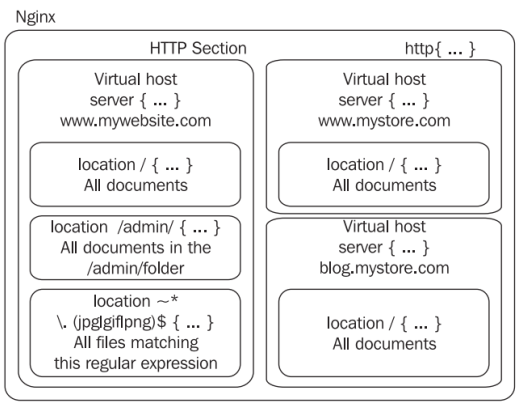

# El módulo HTTP.

El `módulo HTTP` es el componente que contiene todos los bloques fundamentales, directivas y variables del servidor HTTP. Se habilita de forma predeterminada.

Este módulo es el más grande de todos los módulos estándar de Nginx. Proporciona una cantidad impresionante de directivas y variables y está formado por tres bloques principales: `http`, `server` y `location`.

Ya hemos usado este módulo en prácticas previas, concretamente al usar el archivo de configuración predeterminado de Nginx, que incluye una secuencia de directivas y valores, sin una organización aparente. Luego usamos el módulo de eventos, que introdujo el primer bloque, (events). Este bloque es el único espacio reservado para todas las directivas que puede usar el módulo de eventos. Ahora vamos a profundizar en esto, ya que el módulo de HTTP introduce tres nuevos bloques lógicos:

- `http`: Este bloque se inserta en la raíz del archivo de configuración. Nos permite comenzar a definir directivas y bloques de todos los módulos relacionados con el módulo HTTP de Nginx.

- `server`: Este bloque te permite declarar un sitio web. En otras palabras, un sitio web específico (identificado por uno o más nombres de host, por ejemplo, `www.miweb.com`) es reconocido por Nginx y recibe su propia configuración. Este bloque solo puede ser utilizado dentro del bloque `http`.

- `location`: Nos permite definir un grupo de configuraciones que se aplicarán a una ubicación particular en un sitio web. Este bloque puede ser utilizado dentro de un bloque `server` o anidado dentro de otro bloque de `location`.

La siguiente imagen resume la estructura de estos bloques.



Debemos tener en cuenta que en Nginx se aplica el principio de herencia de configuración. Si definimos una configuración en el nivel del bloque `http{...}` (por ejemplo, `gzip on;` para habilitar la compresión gzip), la configuración conservará su valor en los bloques de servidor y ubicación. Como puedes ver en este ejemplo:

```nginx
http {
    # Habilitar la compresión gzip a nivel del bloque http
    gzip on;
    server {
        server_name localhost;
        listen 80;
        # En esta etapa, gzip aún está establecido en on
        location /downloads/ {
            gzip off;
            # Esta directiva solo se aplica a los documentos encontrados
            # en /downloads/
        }
    }
}
```

## Directivas del módulo HTTP.

En cada uno de los tres niveles, se pueden insertar directivas para configurar el comportamiento del servidor web. Existen una cantidad impresionante de directivas, de las cuales mostramos las más importantes o usadas. Para cada directiva, se proporciona una indicación sobre el contexto. Algunas no pueden ser utilizadas en ciertos niveles. Por ejemplo, no tendría sentido insertar una directiva `server_name` en el nivel del bloque `http`, ya que `server_name` es una directiva que afecta directamente a un `servidor virtual`; solo debe insertarse en el bloque del servidor. 


Estas directivas nos permitirá configurar nuestros servidores virtuales, en la práctica, mediante la creación de bloques de servidor que identificaremos ya sea por un ***nombre de host***, o por una ***combinación de dirección IP y puerto***. 

- **Directiva `listen`**:

    Contexto: `server`. Especifica la dirección IP y/o el puerto que se utilizará por el socket de escucha que servirá el sitio web. 
    Sintaxis: `listen [dirección][:puerto] [opciones adicionales];`

    Las opciones adicionales son:

    `default_server`: Especifica que este bloque de servidor se utilizará como el sitio web predeterminado para cualquier solicitud recibida en la dirección IP y puerto especificados.
    `ssl`: Especifica que el sitio web debe ser servido utilizando SSL.
    `http2`: Habilita el soporte para el protocolo HTTP2, si el módulo http2 está presente.
    `proxy_protocol`: Habilita el protocolo proxy para todas las conexiones aceptadas en este puerto.

    Ejemplos:

        listen 192.168.1.1:80;
        listen 127.0.0.1;
        listen 80 default;
        listen [:::a8c9:1234]:80; # Las direcciones IPv6 deben estar entre corchetes
        listen 443 ssl;

- **Directiva `server_name`**:

    Contexto: `server`. Asigna uno o más nombres de host al bloque del servidor. Cuando Nginx recibe una solicitud HTTP, compara el encabezado Host de la solicitud con todos los bloques del servidor. El primer bloque del servidor que coincida con este nombre de host es seleccionado. Si ningún bloque del servidor coincide con el host deseado, Nginx selecciona el primer bloque del servidor que coincida con los parámetros de la directiva listen (por ejemplo, `listen *:80` sería usado para todas las solicitudes recibidas en el puerto 80), dando prioridad al primer bloque que tenga la opción `default_server` habilitada en la directiva listen. Esta directiva acepta comodines así como expresiones regulares. En este caso, el nombre de host debe comenzar con el carácter `~`.

    Sintaxis: `server_name nombre_de_host1 [nombre_de_host2...];`.

    Ejemplos:

        server_name www.sitio_web.com;
        server_name www.sitio_web.com sitio_web.com;
        server_name *.sitio_web.com;
        server_name .sitio_web.com; # combina ambos *.sitio_web.com y sitio_web.com
        server_name *.sitio_web.*;
        server_name ~^(www)\.ejemplo\.com$; # $1 = www


- **Directiva `sendfile`**:

    Contexto: `http`, `server`, `location`. Cuando esta directiva está habilitada, Nginx empleará la llamada al método del kernel `sendfile` para manejar la transmisión de archivos. Si está deshabilitada, Nginx manejará la transferencia de archivos por sí mismo. Dependiendo de la ubicación física del archivo que se está transmitiendo (como NFS), esta opción puede afectar el rendimiento del servidor. 

    Sintaxis: `sendfile on;`


- **Directiva `reset_timedout_connection`**:

     Contexto: `http`, `server`, `location`. El comando ***reset_timedout_connection*** se refiere a la acción de restablecer la conexión cuando esta ha excedido su tiempo de espera. Cuando una conexión de cliente alcanza su tiempo límite, es posible que su información asociada permanezca en la memoria dependiendo del estado en el que se encontraba. Al habilitar esta directiva, se eliminará toda la memoria asociada con la conexión después de que esta haya excedido su tiempo límite.

     Sintaxis: `reset_timedout_connection on;`


- **Directiva `root`**:

    Contexto: `http`, `server`, `location`.El comando ***root*** hacereferencia al directorio que contiene los archivos que deseamos servir. La sintaxis consiste en especificar la ruta del directorio. El valor predeterminado es `html`.

    Sintaxis: `root /home/website.com/public_html;`

- **Directiva `alias`**:

    Contexto: `location`. Asigna una ruta diferente (a la ruta por defecto) para que Nginx recupere documentos para una solicitud específica. Veamos un ejemplo:
    
    ```nginx
    http {
        server {
        server_name localhost;
        root /var/www/website.com/html;
            location /admin/ {
                alias /var/www/admin/;
            }
        }
    }
    ```

    Cuando se recibe una solicitud para `http://localhost/`, los archivos se sirven desde la carpeta `/var/www/website.com/html/`. Sin embargo, si Nginx recibe una solicitud para `http://localhost/admin/`, la ruta utilizada para recuperar los archivos es `/home/website.com/admin/`. 
    
    Sintaxis: Ruta del directorio (no olvides la barra inclinada al final) o ruta del archivo.


- **Directiva `error_page`**:

    Contexto: `http`, `server`, `location` e `if`. Permite asignar URIs a códigos de respuesta HTTP y opcionalmente reemplazar el código con otro.

    Sintaxis: `error_page código1 [código2...] [=código de reemplazo] [=@bloque | URI]`

    Ejemplos:

        error_page 404 /not_found.html;
        error_page 500 501 502 503 504 /server_error.html;
        error_page 403 http://website.com/;
        error_page 404 =200 /index.html; # en caso de error 404, redirigir a index.html con un código de respuesta 200 OK

- **Directiva `index`**:

    Contexto: `http`, `server` y `location`. Define la página predeterminada que Nginx servirá si no se especifica un nombre de archivo en la solicitud (en otras palabras, la página de índice). Podemos especificar varios nombres de archivo y se servirá el primero encontrado. Si ninguno de los archivos especificados se encuentra, Nginx intentará generar un índice automático de los archivos si la directiva `autoindex` está habilitada o devolverá una página de error `403 Forbidden`. Opcionalmente, podemos insertar un nombre de archivo absoluto (como `/page.html`, basado en el directorio raíz del documento) pero solo como el último argumento de la directiva.

    Sintaxis: `index archivo1 [archivo2...] [archivo_absoluto];`

    Ejemplos:

        ```nginx
        index index.php index.html index.htm;
        index index.php index2.php /inicio.php;
        ```

[Vamos al siguiente contenido](./10-F.md)