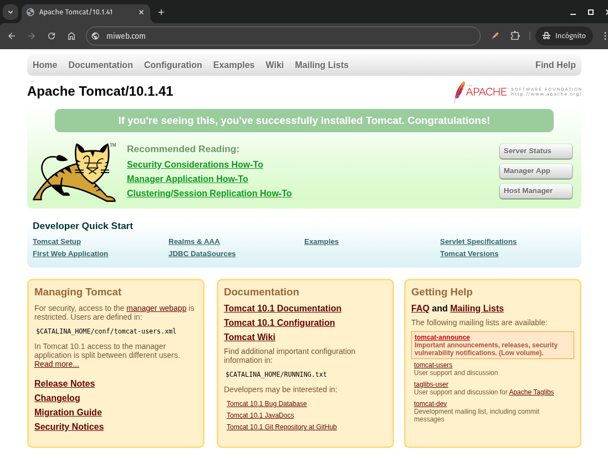

# Introducción a Proxy en Nginx

Un *proxy* en Nginx permite que este servidor web actúe como intermediario entre el cliente (como un navegador web) y otro servidor (como un servidor de aplicaciones o backend). Este enfoque se conoce como **proxy inverso** (*reverse proxy*), y es común cuando se quiere ocultar o proteger el servidor backend, balancear carga o gestionar certificados SSL desde un único punto.

---

## ¿Qué es un Proxy Inverso?

Un proxy inverso intercepta las solicitudes de los clientes y las redirige a uno o varios servidores backend. El cliente no sabe que hay un segundo servidor detrás; solo interactúa con el proxy.

### Ventajas de usar Nginx como proxy inverso:

* Oculta la infraestructura interna.
* Mejora la seguridad y permite controlar el tráfico.
* Facilita el uso de HTTPS.
* Permite balanceo de carga.
* Reduce carga en el backend gracias al *caching*.

---

## Ejemplo básico de configuración de proxy en Nginx

Supongamos que tienes una aplicación en un servidor Tomcat escuchando en `localhost:8080`, y quieres que los usuarios accedan a ella desde `http://miweb.com`.

```nginx
server {
    listen 80;
    server_name miweb.com;

    location / {
        proxy_pass http://localhost:8080;
        proxy_set_header Host $host;
        proxy_set_header X-Real-IP $remote_addr;
        proxy_set_header X-Forwarded-For $proxy_add_x_forwarded_for;
        proxy_set_header X-Forwarded-Proto $scheme;
    }
}
```

## Explicación 

```nginx
location / {
```

Este bloque captura todas las peticiones cuyo URI comience con `/`. Es el path raíz, por lo que capturará todo si no hay bloques `location` más específicos.

```nginx
    proxy_pass http://localhost:8080;
```

Redirige (proxies) la petición al servidor Tomcat corriendo en el puerto `8080` en la misma máquina. Es decir, si el cliente pide `/home`, Nginx hace una solicitud a `http://localhost:8080/home`.

```nginx
    proxy_set_header Host $host;
```

Este encabezado mantiene el nombre de host original enviado por el cliente (`$host`), lo cual puede ser útil si el backend (Tomcat) necesita saber qué dominio fue solicitado.

```nginx
    proxy_set_header X-Real-IP $remote_addr;
```

Agrega un encabezado que indica la IP real del cliente que hizo la petición. Útil para logs o para lógica en la aplicación que dependa de la IP.

```nginx
    proxy_set_header X-Forwarded-For $proxy_add_x_forwarded_for;
```

Este encabezado mantiene una lista encadenada de todas las IPs por las que pasó la solicitud. Añade la IP del cliente a los encabezados `X-Forwarded-For`.

```nginx
    proxy_set_header X-Forwarded-Proto $scheme;
```

Informa al backend sobre si la petición original del cliente fue por HTTP o HTTPS (`$scheme` será `http` o `https`). Esto puede usarse para generar URLs absolutas correctas.

---
### Así es como llegaría al Apache Tomcat pasando por NGINX:


---

# Reverse Proxy (Proxy Inverso en NGINX)

Vamos a describir la configuración básica de un servidor proxy. Aprenderemos a reenviar una solicitud desde NGINX a servidores proxy a través de diferentes protocolos, modificar las cabeceras de solicitud del cliente que se envían al servidor proxy y configurar el almacenamiento en búfer de las respuestas que provienen de los servidores proxy.

---

### Introducción

El proxy inverso se utiliza comúnmente para distribuir la carga entre varios servidores, mostrar contenido de distintos sitios web de manera transparente o reenviar solicitudes para su procesamiento a servidores de aplicaciones mediante protocolos distintos de HTTP.

---

### Reenviar una solicitud a un servidor proxy

Cuando NGINX actúa como proxy de una solicitud, este:

1. Envía la solicitud a un servidor proxy especificado
2. Obtiene la respuesta
3. Devuelve la respuesta al cliente

Es posible hacer proxy de solicitudes hacia un servidor HTTP (otro servidor NGINX o cualquier otro) o hacia un servidor no HTTP (que puede ejecutar una aplicación desarrollada con un framework como PHP o Python) usando un protocolo determinado. Los protocolos compatibles incluyen **FastCGI**, **uwsgi**, **SCGI** y **memcached**.

Para reenviar una solicitud a un servidor HTTP, se utiliza la directiva `proxy_pass` dentro de un bloque `location`. Por ejemplo:

```nginx
location /some/path/ {
    proxy_pass http://www.example.com/link/;
}
```

Esta configuración reenvía todas las solicitudes procesadas en esa ubicación al servidor proxy en la dirección especificada. Esta dirección puede ser un nombre de dominio o una dirección IP, y también puede incluir un puerto:

```nginx
location ~ \.php {
    proxy_pass http://127.0.0.1:8000;
}
```

En el primer ejemplo, la dirección del servidor proxy va seguida por un URI, `/link/`. Si se especifica un URI junto con la dirección, reemplaza la parte del URI de la solicitud que coincide con el parámetro del `location`.

Por ejemplo, una solicitud con el URI `/some/path/page.html` se reenviará a `http://www.example.com/link/page.html`. Sin embargo, si la dirección se especifica sin URI, o no es posible determinar qué parte debe reemplazarse, se reenvía el URI completo de la solicitud (posiblemente modificado).

Para reenviar solicitudes a servidores no HTTP, se deben usar las directivas `*_pass` correspondientes:

* `fastcgi_pass` → servidor FastCGI
* `uwsgi_pass` → servidor uwsgi
* `scgi_pass` → servidor SCGI
* `memcached_pass` → servidor memcached

Ten en cuenta que en estos casos, las reglas para especificar direcciones pueden ser diferentes. También podrías necesitar pasar parámetros adicionales al servidor (consulta la documentación de referencia para más detalles).

La directiva `proxy_pass` también se puede usar para reenviar solicitudes a un grupo de servidores con nombre. En ese caso, las solicitudes se distribuyen entre los servidores según el método especificado.

---

### Reenvío de cabeceras de solicitud

Por defecto, NGINX modifica dos cabeceras en las solicitudes proxy: `"Host"` y `"Connection"`, y elimina las cabeceras con valores de cadena vacía. `"Host"` se establece en el valor de la variable `$proxy_host`, y `"Connection"` se establece en `close`.

Para cambiar estas configuraciones, así como modificar otras cabeceras, se utiliza la directiva `proxy_set_header`. Esta puede especificarse dentro de un bloque `location` o a un nivel superior (por ejemplo, en `server` o `http`). Ejemplo:

```nginx
location /some/path/ {
    proxy_set_header Host $host;
    proxy_set_header X-Real-IP $remote_addr;
    proxy_pass http://localhost:8000;
}
```

Aquí, la cabecera `"Host"` se establece en el valor de la variable `$host`.

Para evitar que se reenvíe una cabecera al servidor proxy, asígnale una cadena vacía:

```nginx
location /some/path/ {
    proxy_set_header Accept-Encoding "";
    proxy_pass http://localhost:8000;
}
```

---

### Configuración de búferes

Por defecto, NGINX **almacena en búfer** las respuestas de los servidores proxy. La respuesta se guarda en búferes internos y no se envía al cliente hasta que se recibe completamente. Esto mejora el rendimiento con clientes lentos, que de otro modo harían perder tiempo al servidor proxy.

El procesamiento de respuestas es más rápido para el servidor backend, ya que NGINX las guarda y las entrega al cliente a su ritmo.

La directiva que habilita o deshabilita este comportamiento es `proxy_buffering`, y por defecto está activada (`on`).

Las directivas `proxy_buffers` y `proxy_buffer_size` controlan cómo NGINX guarda y gestiona esos datos.

* `proxy_buffers`: controla el número y tamaño de los búferes
* `proxy_buffer_size`: define el tamaño del búfer inicial (normalmente usado para las cabeceras)

Ejemplo:

```nginx
location /some/path/ {
    proxy_buffers 16 4k;
    proxy_buffer_size 2k;
    proxy_pass http://localhost:8000;
}
```

Si desactivas el búfer (`proxy_buffering off`), la respuesta se envía al cliente al mismo tiempo que se recibe del servidor proxy. Esto es útil para clientes interactivos que necesitan recibir datos de inmediato:

```nginx
location /some/path/ {
    proxy_buffering off;
    proxy_pass http://localhost:8000;
}
```

En este caso, NGINX solo utiliza el búfer definido por `proxy_buffer_size` para almacenar la parte actual de la respuesta.

---

### Elegir una dirección IP de salida

Si tu servidor proxy tiene varias interfaces de red, puede que necesites especificar una dirección IP concreta para salir hacia el servidor proxy. Esto es útil si el servidor backend solo acepta conexiones desde IPs específicas.

Para ello, se utiliza la directiva `proxy_bind`, especificando la IP:

```nginx
location /app1/ {
    proxy_bind 127.0.0.1;
    proxy_pass http://example.com/app1/;
}

location /app2/ {
    proxy_bind 127.0.0.2;
    proxy_pass http://example.com/app2/;
}
```

También puedes usar una variable. Por ejemplo, `$server_addr` representa la IP de la interfaz que aceptó la solicitud:

```nginx
location /app3/ {
    proxy_bind $server_addr;
    proxy_pass http://example.com/app3/;
}
```


## ACTIVIDAD PRACTICA

**Objetivo:**
Configurar NGINX como proxy inverso para una aplicación web que corre localmente en el puerto 3000 (por ejemplo, una app en Node.js o Python Flask).

---

### Requisitos

* Tener instalado NGINX (`sudo apt install nginx`)
* Tener una app corriendo en `http://localhost:3000`

---

### Paso 1: Crear el archivo de configuración

Crea un nuevo archivo de configuración en NGINX:

```bash
sudo nano /etc/nginx/sites-available/proxy-ejemplo
```

Pega lo siguiente:

```nginx
server {
    listen 80;
    server_name localhost;

    location / {
        proxy_pass http://localhost:3000;

        proxy_set_header Host $host;
        proxy_set_header X-Real-IP $remote_addr;
        proxy_set_header X-Forwarded-For $proxy_add_x_forwarded_for;
        proxy_set_header X-Forwarded-Proto $scheme;
    }
}
```

Guarda y cierra (`Ctrl + O`, `Enter`, `Ctrl + X`).

---

### Paso 2: Activar la configuración

Crea el enlace simbólico:

```bash
sudo ln -s /etc/nginx/sites-available/proxy-ejemplo /etc/nginx/sites-enabled/
```

---

### Paso 3: Verificar sintaxis

Antes de reiniciar NGINX, asegúrate de que todo esté correcto:

```bash
sudo nginx -t
```

---

### Paso 4: Reiniciar NGINX

Aplica los cambios:

```bash
sudo systemctl restart nginx
```

---

### Paso 5: Probar

Abre tu navegador y ve a `http://localhost`. Deberías ver la aplicación que corre en el puerto 3000.

---
---

## ACTIVIDAD PRÁCTICA 2
NGINX como **proxy inverso para múltiples aplicaciones según la ruta**.

---

**Objetivo:**
Configurar NGINX para reenviar solicitudes a distintas apps locales, dependiendo del **path** de la URL.

---

### Escenario

* Una app en `localhost:3000` (por ejemplo, un frontend React)
* Otra app en `localhost:4000` (por ejemplo, una API backend en Flask o Node.js)
* Queremos:

  * `http://localhost/app1` → redirija a `localhost:3000`
  * `http://localhost/app2` → redirija a `localhost:4000`

---

### Paso 1: Crear el archivo de configuración

```bash
sudo nano /etc/nginx/sites-available/multi-proxy
```

Contenido:

```nginx
server {
    listen 80;
    server_name localhost;

    location /app1/ {
        proxy_pass http://localhost:3000/;
        proxy_set_header Host $host;
        proxy_set_header X-Real-IP $remote_addr;
        proxy_set_header X-Forwarded-For $proxy_add_x_forwarded_for;
        proxy_set_header X-Forwarded-Proto $scheme;
    }

    location /app2/ {
        proxy_pass http://localhost:4000/;
        proxy_set_header Host $host;
        proxy_set_header X-Real-IP $remote_addr;
        proxy_set_header X-Forwarded-For $proxy_add_x_forwarded_for;
        proxy_set_header X-Forwarded-Proto $scheme;
    }
}
```

**Nota:** Es importante incluir la **barra final `/`** en `proxy_pass` para que se reemplace correctamente el path original.

---

### Paso 2: Activar la configuración

```bash
sudo ln -s /etc/nginx/sites-available/multi-proxy /etc/nginx/sites-enabled/
```

---

### Paso 3: Verificar sintaxis

```bash
sudo nginx -t
```

---

### Paso 4: Reiniciar NGINX

```bash
sudo systemctl restart nginx
```

---

### Paso 5: Ajustar las apps (si es necesario)

Asegúrate de que ambas aplicaciones **soportan estar montadas en un subpath** (`/app1` y `/app2`). Si no, puedes usar reglas de reescritura o configurar las apps para aceptar un `basePath`.


---
---
  
  

# Configuracion de seguridad avanzada

La configuración de seguridad avanzada en Nginx está especialmente pensada para entornos de producción. Esto incluye prácticas recomendadas para proteger tu servidor frente a ataques comunes como XSS, clickjacking, sniffing, y otros vectores de ataque.

---

Algunas medidas son:


### 1. **Ocultar la versión de Nginx**

```nginx
server_tokens off;
```

#### ¿Qué hace?

Evita que Nginx muestre su número de versión en las respuestas HTTP y en páginas de error como el famoso `502 Bad Gateway`.

#### ¿Por qué es importante?

Mostrar la versión del servidor web ayuda a los atacantes a identificar vulnerabilidades específicas de esa versión. Ocultarla **reduce el riesgo de ataques automatizados** dirigidos a versiones conocidas como vulnerables.

---

### 2. **Cabeceras de seguridad**

Agrega estas cabeceras en tu bloque `server` o `http`:

```nginx
add_header X-Content-Type-Options "nosniff" always;
add_header X-Frame-Options "SAMEORIGIN" always;
add_header X-XSS-Protection "1; mode=block" always;
add_header Referrer-Policy "strict-origin-when-cross-origin" always;
add_header Permissions-Policy "geolocation=(), microphone=()" always;
add_header
```

Estas cabeceras Son instrucciones que el servidor envía al navegador para controlar su comportamiento y **mitigar amenazas comunes** como XSS, clickjacking y fugas de información.

---

#### `X-Content-Type-Options: nosniff`

Evita que los navegadores “adivinen” el tipo de contenido y lo ejecuten como algo distinto al declarado.

> **Protege contra:** ataques de tipo MIME-sniffing, que pueden ejecutar scripts maliciosos.

---

#### `X-Frame-Options: SAMEORIGIN`

Impide que tu sitio se cargue dentro de un `<iframe>` en otro dominio.

> **Protege contra:** clickjacking (engañar al usuario para que haga clic en algo que no ve).

---

#### `X-XSS-Protection: 1; mode=block`

Activa el filtro anti-XSS incorporado en algunos navegadores (aunque ya está obsoleto en otros como Chrome).

> **Protege contra:** ciertos tipos de ataques de Cross-Site Scripting (XSS).

---

#### `Referrer-Policy: strict-origin-when-cross-origin`

Controla qué información del encabezado `Referer` se envía cuando un usuario navega desde tu sitio hacia otro.

> **Protege contra:** fugas de datos sensibles en URLs (como tokens, IDs, etc.).

---

#### `Permissions-Policy: geolocation=(), microphone=()`

Antes conocida como `Feature-Policy`. Restringe el acceso a ciertas APIs del navegador.

> **Protege contra:** el uso no autorizado de funcionalidades como geolocalización o micrófono.


---

## Ejemplo de Configuración de seguridad avanzada para Nginx

```nginx
# Oculta la versión de Nginx
server_tokens off;

# Seguridad en cabeceras HTTP
add_header X-Frame-Options "SAMEORIGIN" always;
add_header X-Content-Type-Options "nosniff" always;
add_header X-XSS-Protection "1; mode=block" always;
add_header Referrer-Policy "strict-origin-when-cross-origin" always;
add_header Permissions-Policy "geolocation=(), microphone=(), camera=()" always;
add_header Strict-Transport-Security "max-age=31536000; includeSubDomains; preload" always;

# Redirección forzada a HTTPS
server {
    listen 80;
    server_name ejemplo.com www.ejemplo.com;
    return 301 https://$host$request_uri;
}

# HTTPS server
server {
    listen 443 ssl http2;
    server_name ejemplo.com www.ejemplo.com;

    ssl_certificate /etc/ssl/certs/ejemplo.pem;
    ssl_certificate_key /etc/ssl/private/ejemplo.key;
    ssl_protocols TLSv1.2 TLSv1.3;
    ssl_ciphers 'TLS_AES_256_GCM_SHA384:TLS_CHACHA20_POLY1305_SHA256:TLS_AES_128_GCM_SHA256';
    ssl_prefer_server_ciphers on;
    ssl_session_cache shared:SSL:10m;
    ssl_session_timeout 10m;
    ssl_session_tickets off;

    # Protección contra ataques comunes
    client_max_body_size 10M;
    client_body_timeout 12;
    keepalive_timeout 15;
    send_timeout 10;

    # Evitar acceso a archivos ocultos o peligrosos
    location ~ /\.(?!well-known) {
        deny all;
    }

    # Limita métodos HTTP permitidos
    if ($request_method !~ ^(GET|POST|HEAD)$) {
        return 444;
    }

    # Protección contra clickjacking en iframes
    add_header X-Frame-Options "SAMEORIGIN";

    # Bloqueo de User-Agents maliciosos (opcional)
    if ($http_user_agent ~* (malicious|scanner|sqlmap|nmap)) {
        return 403;
    }

    # Acceso al root del sitio
    root /var/www/ejemplo.com/html;
    index index.html index.htm index.php;
}
```

---

### Consejos adicionales

* **Fail2ban**: úsalo con logs de Nginx para bloquear IPs maliciosas.
* **ModSecurity**: se puede integrar con Nginx como WAF.
* **Certbot**: automatiza tus certificados SSL con Let's Encrypt.
* **Revisión de logs**: monitoriza `/var/log/nginx/access.log` y `/var/log/nginx/error.log`.

[Vamos al siguiente contenido](./10-K.md)
