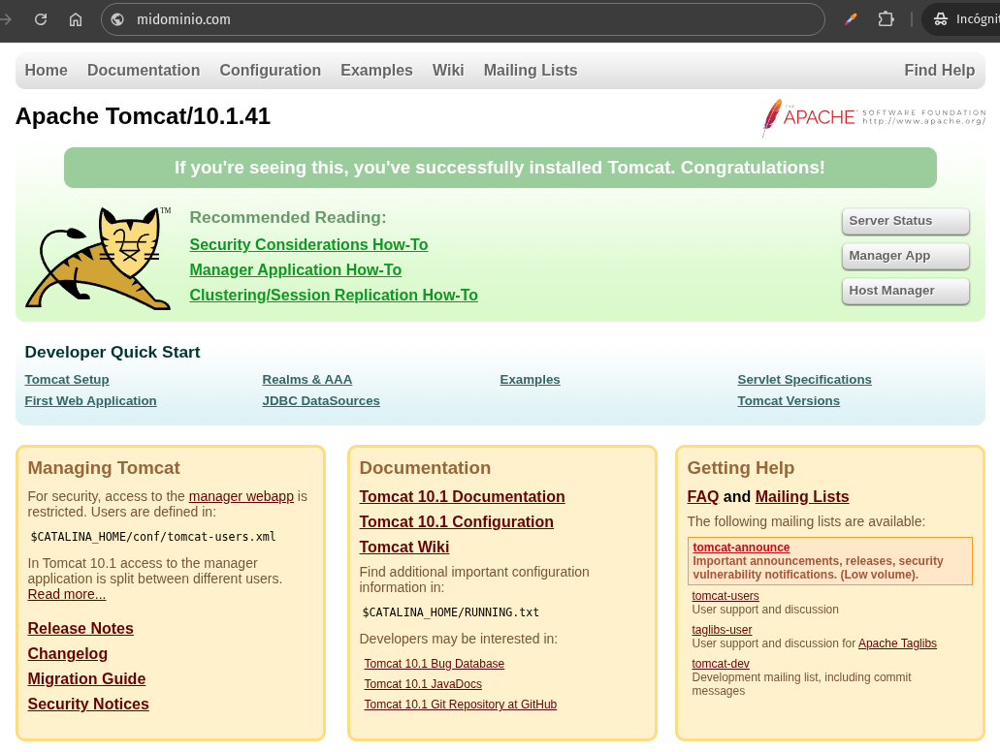

# Balaceo de Carga (Load Balancing)

El **balanceo de carga en Nginx** es una técnica para distribuir el tráfico de red entre varias instancias de aplicación (web), con el objetivo de mejorar la disponibilidad, rendimiento y escalabilidad de una aplicación web.

### ¿Cómo funciona?

Cuando un cliente realiza una petición, Nginx actúa como proxy reverso, recibiendo esa petición y redirigiéndola a uno de los servidores del pool (grupo de servidores backend) según un algoritmo de balanceo configurado.

### Tipos de algoritmos de balanceo de carga en Nginx

1. **Round Robin (por defecto)**
   Distribuye las peticiones de manera secuencial a cada servidor. Ejemplo:

   ```
   http {
    upstream myapp1 {
        server srv1.example.com;
        server srv2.example.com;
        server srv3.example.com;
     }

    server {
        listen 80;

        location / {
            proxy_pass http://myapp1;
        }
     }
   }
   ```

   En el ejemplo anterior, hay 3 instancias de la misma aplicación ejecutándose en srv1-srv3. Cuando no se configura específicamente un método de balanceo de carga, se utiliza por defecto el método round-robin. Todas las solicitudes se redirigen al grupo de servidores myapp1, y nginx aplica balanceo de carga HTTP para distribuir dichas solicitudes.

   La implementación de proxy inverso en nginx incluye balanceo de carga para HTTP, HTTPS, FastCGI, uwsgi, SCGI, memcached y gRPC.

2. **Least Connections**
   Envía la petición al servidor con menos conexiones activas.
   
   Otra técnica de balanceo de carga es **least-connected** (el menos conectado). Esta permite controlar la carga sobre las instancias de la aplicación de forma más equitativa en situaciones donde algunas solicitudes tardan más en completarse.

   Con el balanceo de carga *least-connected*, nginx intentará no sobrecargar a un servidor de aplicaciones ocupado con demasiadas solicitudes, distribuyendo las nuevas solicitudes a un servidor que esté menos ocupado.

   El balanceo de carga *least-connected* en nginx se activa utilizando la directiva `least_conn` como parte de la configuración del grupo de servidores:

   ```
    upstream myapp1 {
        least_conn;
        server srv1.example.com;
        server srv2.example.com;
        server srv3.example.com;
    }
   ```

3. **IP Hash**
   Asigna clientes a servidores según su IP. Útil para mantener sesiones persistentes.

   **Persistencia de sesión**

	Es importante tener en cuenta que con los métodos de balanceo de carga *round-robin* o *least-connected*, cada solicitud sucesiva de un cliente puede ser distribuida potencialmente a un servidor diferente. No hay garantía de que el mismo cliente sea dirigido siempre al mismo servidor.

	Si se necesita vincular a un cliente con un servidor de aplicaciones en particular —es decir, hacer que la sesión del cliente se "fije" o sea "persistente", intentando siempre seleccionar el mismo servidor— se puede usar el mecanismo de balanceo de carga *ip-hash*.

	Con *ip-hash*, la dirección IP del cliente se utiliza como clave de hash para determinar qué servidor del grupo debe ser seleccionado para las solicitudes de ese cliente. Este método garantiza que las solicitudes de un mismo cliente siempre se dirigirán al mismo servidor, salvo que dicho servidor no esté disponible.

	Para configurar el balanceo de carga *ip-hash*, basta con añadir la directiva `ip_hash` en la configuración del grupo *upstream*:

	```nginx
	upstream myapp1 {
	    ip_hash;
	    server srv1.example.com;
	    server srv2.example.com;
	    server srv3.example.com;
	}
	```

4. **Weight load balancing (Balanceo de carga ponderado o con ponderación)**
   Permite asignar más tráfico a servidores más potentes.

   También es posible influir aún más en los algoritmos de balanceo de carga de nginx mediante el uso de **pesos** asignados a los servidores.

   En los ejemplos anteriores, no se configuraron pesos, lo que significa que todos los servidores especificados se consideran igualmente aptos para el método de balanceo utilizado.

   En el caso particular de *round-robin*, esto implica una distribución más o menos equitativa de las solicitudes entre los servidores —  siempre que haya suficientes solicitudes y estas se procesen de manera uniforme y rápida.

   Cuando se especifica el parámetro `weight` para un servidor, ese peso se tiene en cuenta como parte de la decisión de balanceo.

	```nginx
	upstream myapp1 {
	    server srv1.example.com weight=3;
	    server srv2.example.com;
	    server srv3.example.com;
	}
	```

   Con esta configuración, cada 5 nuevas solicitudes se distribuirán entre las instancias de la aplicación de la siguiente manera: 3 solicitudes se enviarán a `srv1`, 1 a `srv2` y 1 a `srv3`.

   También es posible usar pesos en los métodos de balanceo *least-connected* e *ip-hash* en las versiones más recientes de nginx.


### Otras características clave

* **Detección de fallos (health checks):** 
La implementación de **proxy inverso en nginx** incluye comprobaciones de estado del servidor *in-band* (o pasivas). Si la respuesta de un servidor en particular falla con un error, nginx marcará ese servidor como fallido e intentará evitar seleccionarlo para solicitudes entrantes posteriores durante un tiempo.

La directiva `max_fails` establece el número de intentos fallidos consecutivos de comunicación con el servidor que deben ocurrir durante el período definido por `fail_timeout`. Por defecto, `max_fails` está configurado en 1. Si se establece en 0, se desactivan las comprobaciones de estado para ese servidor.

El parámetro `fail_timeout` también define cuánto tiempo se considerará al servidor como fallido. Después del intervalo definido por `fail_timeout` tras el fallo del servidor, nginx comenzará a "sondearlo" nuevamente de forma progresiva usando solicitudes reales de clientes. Si estas pruebas tienen éxito, el servidor vuelve a marcarse como activo.

### Ventajas

* Escalabilidad horizontal fácil de implementar.
* Alta disponibilidad.
* Posibilidad de realizar mantenimiento en servidores sin afectar al servicio global.

### Limitaciones

* Nginx OSS no incluye health checks activos sin módulos externos.
* No tiene gestión de sesiones incorporada (pero se puede usar IP hash o sticky sessions con módulos).

---

## Healthchecks en balaceo de carga en nginx. 

En Nginx **open source**, no existe soporte nativo para health checks activos (comprobaciones periódicas automáticas a los servidores backend). Sin embargo, puedes hacer **health checks pasivos**, y si usas **NGINX Plus**, sí puedes hacer **health checks activos reales**.

---

## Opción 1: Health checks pasivos (válido en Nginx open source)

Nginx detecta automáticamente **errores de conexión o fallos en la respuesta** de los backends, y los evita temporalmente.

### Ejemplo con `max_fails` y `fail_timeout`:

```nginx
http {
    upstream backend {
        server 192.168.1.101:8080 max_fails=3 fail_timeout=10s;
        server 192.168.1.102:8080 max_fails=3 fail_timeout=10s;
    }

    server {
        listen 80;

        location / {
            proxy_pass http://backend;
        }
    }
}
```

### ¿Qué hace esta configuración?

* Si un servidor **falla 3 veces seguidas en 10 segundos**, Nginx **deja de enviarlo tráfico durante 10 segundos**.
* Luego lo vuelve a probar al recibir nuevas peticiones.

### Cómo probarlo

1. Arranca ambos servidores backend (por ejemplo con Python o Nginx en puertos 8080 y 8081).
2. Detén uno (simula un fallo).
3. Haz peticiones al balanceador con `curl` o `ab`.
4. Observa cómo Nginx **deja de enviar tráfico al backend que falla**.

---

## Opción 2: Health checks activos (solo en NGINX Plus)

En NGINX Plus puedes hacer **comprobaciones periódicas reales** enviando solicitudes a un URI de prueba.

### Ejemplo en NGINX Plus:

```nginx
upstream backend {
    zone backend 64k;
    server 192.168.1.101:8080;
    server 192.168.1.102:8080;

    health_check uri=/salud interval=5 fails=2 passes=1;
}
```

### ¿Qué hace esto?

* Envía peticiones `GET /salud` cada 5 segundos a cada servidor.
* Si falla 2 veces seguidas, lo marca como inactivo.
* Si responde correctamente 1 vez después, lo vuelve a activar.

### Cómo probarlo

1. Crea una ruta `/salud` en tu backend que devuelva `200 OK`.
2. Luego modifícala para que devuelva `500` o simula caída del servicio.
3. NGINX Plus detectará esto automáticamente y desactivará el backend.

---

## Alternativa para open source: usar herramientas externas

Puedes usar scripts externos o servicios como:

* `cron + curl + nginx -s reload`
* `keepalived`, `consul`, `haproxy` como complemento para checks avanzados

---

## Conclusión

| Tipo de health check            | Disponible en Nginx OSS | Necesita NGINX Plus | Observaciones                        |
| ------------------------------- | ----------------------- | ------------------- | ------------------------------------ |
| Pasivo (fallo por conexión)     | Sí                      | No                  | Detecta fallos al recibir peticiones |
| Activo (peticiones programadas) | No                      | Sí                  | Requiere licencia de NGINX Plus      |


---

## ACTIVIDAD PRACTICA
** Falso balanceo de carga con Nginx en Ubuntu 20.04**

### **1. Preparativos**

Partimos de nuestro servidor nginx en Ubuntu 20.04


### **2. Crea tres servidores backend locales (en distintos puertos)**
#### Crea tres "backends" locales simulados con contenido distinto

```bash
sudo mkdir -p /var/www/backend1
sudo mkdir -p /var/www/backend2
sudo mkdir -p /var/www/backend3

echo "RESPUESTA DEL BACKEND 1" | sudo tee /var/www/backend1/index.html
echo "RESPUESTA DEL BACKEND 2" | sudo tee /var/www/backend2/index.html
echo "RESPUESTA DEL BACKEND 3" | sudo tee /var/www/backend3/index.html
```

#### Crea configuraciones Nginx para cada backend

## Backend 1
```bash
server {
    listen 8081;
    server_name localhost;

    location / {
        root /var/www/backend1;
        index index.html;
    }
}
```

## Backend 2
```bash
server {
    listen 8082;
    server_name localhost;

    location / {
        root /var/www/backend2;
        index index.html;
    }
}
```

## Backend 3
```bash
server {
    listen 8083;
    server_name localhost;

    location / {
        root /var/www/backend3;
        index index.html;
    }
}
```

Activa los sitios:

```bash
sudo ln -s /etc/nginx/sites-available/backend1 /etc/nginx/sites-enabled/
sudo ln -s /etc/nginx/sites-available/backend2 /etc/nginx/sites-enabled/
sudo ln -s /etc/nginx/sites-available/backend3 /etc/nginx/sites-enabled/
```

---


### **3. Configura el "balanceador" Nginx principal (en el puerto 80)**

#### loadbalancer

```bash
upstream mis_backends {
    ip_hash;
    server 127.0.0.1:8081;
    server 127.0.0.1:8082;
    server 127.0.0.1:8083;
}

server {
    listen 80;
    server_name localhost;

    location / {
        proxy_pass http://mis_backends;
        proxy_set_header Host \$host;
        proxy_set_header X-Real-IP \$remote_addr;
    }
}
```

```bash
sudo ln -s /etc/nginx/sites-available/loadbalancer /etc/nginx/sites-enabled/
sudo rm /etc/nginx/sites-enabled/default
```

---

### **4. Verifica y reinicia Nginx**

```bash
sudo nginx -t
sudo systemctl restart nginx
```

---

### **5. Prueba el comportamiento**

Desde la misma máquina:

```bash
curl http://localhost/
```

Verás siempre la misma respuesta del mismo backend, gracias a `ip_hash`.

Simula otro cliente con distinta IP:

```bash
curl -H "X-Real-IP: 2.3.4.5" http://localhost/
curl -H "X-Real-IP: 6.7.8.9" http://localhost/
```
Distintas IPs verán respuestas de backends distintos, pero *persistentes* para cada IP.
  
¡HABRIA QUE PROBARLO DESDE DISTINTAS MAQUINAS!  
  
OJO: Las dos IPs llegan a la misma maquina por X-Real-IP no llega en relaidad al balanceador de carga, sino que es un encabezado para el host.

## Resultado

Este "balanceo de carga" con `ip_hash` en realidad **fuerza la persistencia de sesión**, enviando siempre las solicitudes del mismo cliente al mismo backend. Si se quiere un balanceo real (más distribuido), se podría quitar `ip_hash`.

---
---

# ACTIVIDAD PRÁCTICA: Balanceo de carga con health checks pasivos en Nginx

## Objetivo

Implementar un **proxy inverso en Nginx** que realice balanceo de carga entre dos instancias locales de Tomcat (en los puertos 8080 y 8081), con:

* Algoritmo **round-robin**.
* Health check **pasivo** con `max_fails` y `fail_timeout`.
* Comprobación **visual** del backend activo (usando diferentes rutas visibles).
* Recuperación automática del servidor una vez vuelve a estar disponible.

---

## Escenario

* **Servidor A**: [http://localhost:8080](http://localhost:8080) (muestra la página de inicio de Tomcat).
* **Servidor B**: [http://localhost:8081](http://localhost:8081) (muestra la página de inicio de Tomcat en el otro servidor).
* Ambos servidores corren en la **misma máquina**.
* Nginx escuche en **puerto 80**, en el dominio ficticio **midominio.com**.

---

## Requisitos

1. Ubuntu 20.04
2. Nginx instalado (`sudo apt install nginx`)
3. Apache Tomcat corriendo en puertos 8080 y 8081
4. Entrada en `/etc/hosts` para redirigir `midominio.com` a `127.0.0.1`:

   ```
   127.0.0.1 midominio.com
   ```

---

## Enunciado

Configura Nginx como balanceador de carga para `midominio.com`, distribuyendo peticiones entre los dos servidores Tomcat locales. El primer backend responde con la página raíz (`/`) y el segundo con la ruta `/` también. 
  
Para  que podamos distinguir cuál responde, crearemos archivos logs en cada servidor y en el upstream de balaanceo de carga. Si uno de los servidores falla, el otro debe continuar respondiendo sin interrupciones. Cuando el servidor caído se recupere, Nginx debe reintegrarlo automáticamente.

---

## Resolución

### 1. Configurar Nginx

Modifica nginx.conf. Agrega un log con formato completo comun a los dos servidores de backoffice. Debes de definirlo ANTES de la linea de código que referencia a la carga de los sitios habilitados, o NO CARGARÁ la referencia formato de log.

Parte de nginx.conf a modificar:
```ningx
# nignx.con
...
http {
...
...
        ##
        # Logging Settings
        ##

        log_format full_log '$remote_addr - $time_local "$request" '
                            '$status $body_bytes_sent "$http_referer" "$http_user_agent" '
                            'uri="$uri" upstream="$upstream_addr"';
#
#       log_format static_log '$remote_addr - $time_local "$request" '
#                             '$status uri="$uri" referer="$http_referer"';

        access_log /var/log/nginx/access.log;
        error_log /var/log/nginx/error.log;

        ##
        # Gzip Settings
        ##

        gzip on;

        # gzip_vary on;
        # gzip_proxied any;
        # gzip_comp_level 6;
        # gzip_buffers 16 8k;
        # gzip_http_version 1.1;
        # gzip_types text/plain text/css application/json application/javascript text/xml application/xml application/xml+rss>

        ##
        # Virtual Host Configs
        ##

        include /etc/nginx/conf.d/*.conf;
        include /etc/nginx/sites-enabled/*;

}
...
```

Para estar más seguros de que servidor estamos configurando, está activo, poderlo comprobar, etc., lo que vamos a hacer es definir dos sitios virtuales, consumiendo dos puertos más el 8082 y el 8083, que serán servidores proxies que apuntarán, respectivamente a cada tomcat en los puertos 8080 y 8081 respectivamente. Además, añadiremos archivos logs a ambos servidores definidos, de forma que podamos hacer seguimiento en dichos logs, de la carga del contenido, etc.  

## Archivo /etc/sites-available/tomcatproxy8082log
```nginx
server {
    listen 8082;
    server_name localhost;

    access_log /var/log/nginx/8082_access.log full_log;

    location / {
        proxy_pass http://localhost:8081/;
        proxy_set_header Host $host;
        proxy_set_header X-Real-IP $remote_addr;
        proxy_set_header X-Forwarded-For $proxy_add_x_forwarded_for;
        proxy_set_header X-Forwarded-Proto $scheme;
    }
}
```

## Archivo /etc/sites-available/tomcatproxy8083log
```nginx
server {
    listen 8083;
    server_name localhost;

    access_log /var/log/nginx/8083_access.log full_log;

    location / {
        proxy_pass http://localhost:8080/;
        proxy_set_header Host $host;
        proxy_set_header X-Real-IP $remote_addr;
        proxy_set_header X-Forwarded-For $proxy_add_x_forwarded_for;
        proxy_set_header X-Forwarded-Proto $scheme;
    }
}
```

Solo con estos dos sitios, en cuanto los habilitemos y nos pasen las pruebas de `nginx -t` nos cargarán cada tomcat en 2 puertos:

### Tomcat servicio 1 (tomcat a secas)
Cargará en el navegador al poner la URL:
* http://midominio.com:8080
* http://midominio.com:8083

### Tomcat servicio 2 (tomcat2 a secas)
Cargará en el navegador al poner la URL:
* http://midominio.com:8081
* http://midominio.com:8082

Podemos probar parando los servicios y comprobando que ambas URLs no cargan. Lo haremos para hacer seguimiento manual de disponibilidad en ambos servidores haciendo:

```bash
service tomcat stop
service tomcat2 stop
service tomcat start 
service tomcat2 start
```
Ejecutaremos secuencialmente cada comando y comprobaremos que se van parando en ambos sitios a la vez los sitios y van cargando.

Crea un nuevo archivo de configuración:

```bash
sudo nano /etc/nginx/sites-available/midominio.com
```

### /etc/nginx/sites-available/midominio.com
```nginx
# Bloque upstream con parámetros de fallo
upstream tomcat_backend {
    server localhost:8082 max_fails=2 fail_timeout=10s;
    server localhost:8083 max_fails=2 fail_timeout=10s;
}

# Formato de log personalizado
log_format lb_log '$remote_addr - [$time_local] "$request" '
                  '$status $body_bytes_sent '
                  'upstream="$upstream_addr" '
                  'response_time=$upstream_response_time '
                  'referer="$http_referer" '
                  'ua="$http_user_agent"';

# Servidor principal
server {
    listen 80;
    server_name midominio.com;

    access_log /var/log/nginx/loadbalancer_access.log lb_log;
    error_log /var/log/nginx/loadbalancer_error.log notice;

    location / {
        proxy_pass http://tomcat_backend/;

        # Reintentar si un backend falla
        proxy_next_upstream error timeout http_502 http_504;

        # Cabeceras hacia el backend
        proxy_set_header Host $host;
        proxy_set_header X-Real-IP $remote_addr;
        proxy_set_header X-Forwarded-For $proxy_add_x_forwarded_for;
        proxy_set_header X-Forwarded-Proto $scheme;
    }
}
```

Esta configuración de Nginx implementa un balanceador de carga con funciones de detección de fallos y registro detallado de actividad. 

---

## Definición del grupo de servidores (`upstream`)

```nginx
upstream tomcat_backend {
    server localhost:8082 max_fails=2 fail_timeout=10s;
    server localhost:8083 max_fails=2 fail_timeout=10s;
}
```

Este bloque crea un grupo de servidores backend al que Nginx enviará las peticiones. En este caso, hay dos servidores Tomcat escuchando en los puertos 8082 y 8083.

Las opciones `max_fails` y `fail_timeout` sirven para controlar la detección de fallos:

* `max_fails=2` indica que si un servidor falla dos veces consecutivas dentro del periodo de tiempo definido, Nginx lo marcará como no disponible temporalmente.
* `fail_timeout=10s` define ese periodo de tiempo: durante diez segundos después de los fallos, Nginx no enviará más peticiones a ese servidor.

Esto ayuda a evitar que los usuarios reciban errores cuando uno de los servidores está inestable.

---

## Formato personalizado para el archivo de acceso (`access_log`)

```nginx
log_format lb_log '$remote_addr - [$time_local] "$request" '
                  '$status $body_bytes_sent '
                  'upstream="$upstream_addr" '
                  'response_time=$upstream_response_time '
                  'referer="$http_referer" '
                  'ua="$http_user_agent"';
```

Este bloque define un formato de log personalizado llamado `lb_log`, que permite registrar información clave sobre cada solicitud:

* `$remote_addr`: la dirección IP del cliente.
* `$time_local`: fecha y hora del acceso.
* `$request`: método, ruta y versión del protocolo.
* `$status`: código de respuesta HTTP.
* `$body_bytes_sent`: cantidad de datos enviados al cliente.
* `$upstream_addr`: dirección del servidor backend que respondió.
* `$upstream_response_time`: tiempo de respuesta del backend.
* `$http_referer`: origen de la solicitud.
* `$http_user_agent`: identificador del navegador o herramienta cliente.

Este formato es útil para depurar el comportamiento del balanceo y saber exactamente qué backend está atendiendo cada petición y cómo está rindiendo.

---

## Configuración del servidor de balanceo (`server`)

```nginx
server {
    listen 80;
    server_name midominio.com;

    access_log /var/log/nginx/loadbalancer_access.log lb_log;
    error_log /var/log/nginx/loadbalancer_error.log notice;

    location / {
        proxy_pass http://tomcat_backend/;

        proxy_next_upstream error timeout http_502 http_504;

        proxy_set_header Host $host;
        proxy_set_header X-Real-IP $remote_addr;
        proxy_set_header X-Forwarded-For $proxy_add_x_forwarded_for;
        proxy_set_header X-Forwarded-Proto $scheme;
    }
}
```

Este bloque define el servidor Nginx que actuará como balanceador de carga:

* `listen 80` indica que escucha en el puerto 80 (HTTP).
* `server_name midominio.com` define el nombre del servidor.

Se configuran dos archivos de log:

* `access_log` recoge las solicitudes procesadas, usando el formato `lb_log`.
* `error_log` guarda los errores de conexión, fallos de backend y eventos importantes, en nivel `notice`.

Dentro del bloque `location /`, se establece el comportamiento del proxy:

* `proxy_pass http://tomcat_backend/;` envía las peticiones al grupo definido en el bloque `upstream`.
* `proxy_next_upstream` indica que, si uno de los backends devuelve un error (`502`, `504`, `timeout`, o si no responde), Nginx intentará reenviar la petición a otro servidor disponible del clúster.
* Las directivas `proxy_set_header` aseguran que se pasen al backend las cabeceras necesarias para mantener la información del cliente original (como la IP, el protocolo y el dominio solicitado).

---

Nos podemos dar cuenta de varios ajustes nuevos en nuestro progreso de configuración de nginx
**El log, se ecuentra entre las secciones upstream y server**: Es decir, que se encuentra dentro del ambito (contexto) de http{...} y por tanto podemos definirlo ahi. ¿por que no hemos hecho lo mismo en los sitios proxy que apuntan a cada Tomcat? Por si definimos en los archivos de los sitios virtuales el formato de log 2 veces, al hacer `nginx -t` nos dará error, por redefinición del formato del log. Solo podríamos evitarlo definiendo 2 formatos (iguales en suma) pero con nombres distintos.

En **Nginx (versión open source)**, la *detección de recuperación de los sitios backend* no se configura explícitamente con una directiva como en otros sistemas (por ejemplo, `health checks` activos), sino que **está implícita en cómo funcionan las opciones `max_fails` y `fail_timeout`** en el bloque `upstream`.


## De nuevo: ¿Cuándo y cómo detecta Nginx que un backend está caído?

Se usa esta sintaxis en el bloque `upstream`:

```nginx
upstream tomcat_backend {
    server localhost:8082 max_fails=2 fail_timeout=10s;
    server localhost:8083 max_fails=2 fail_timeout=10s;
}
```

### Parámetros:

* **`max_fails=2`**: Nginx marcará el servidor como *fallido* si hay 2 intentos fallidos consecutivos dentro del tiempo definido.
* **`fail_timeout=10s`**: Este es el intervalo en el que se cuentan los fallos y también el periodo durante el cual el servidor será considerado *no disponible*.

---

## ¿Cómo se recupera un backend en Nginx?

Aquí está la clave: **Nginx no hace "health checks" activos en la versión open source.**
**No sondea los backends de forma periódica.**

En lugar de eso, la recuperación ocurre así:

1. Si un servidor fue marcado como fallido (tras alcanzar `max_fails` dentro de `fail_timeout`).
2. Pasado el tiempo definido por `fail_timeout`, **el backend vuelve a estar disponible automáticamente**.
3. En la siguiente solicitud que se asigne a ese backend, Nginx lo reintenta:

   * Si responde correctamente: vuelve a marcarlo como disponible.
   * Si vuelve a fallar: se vuelve a marcar como fallido por otros `fail_timeout` segundos.

---

## ¿Dónde se configura?

Se configura **dentro del bloque `upstream`**, y solo allí, usando:

* `max_fails`
* `fail_timeout`

Ejemplo completo:

```nginx
upstream tomcat_backend {
    server localhost:8082 max_fails=3 fail_timeout=15s;
    server localhost:8083 max_fails=3 fail_timeout=15s;
}
```

---

## ¿Cómo mejorar esto si necesitas comprobación activa?

La versión **Nginx Plus** permite definir `health_check` activos así:

```nginx
upstream tomcat_backend {
    server 127.0.0.1:8080;
    server 127.0.0.1:8081;
    health_check interval=5 fails=2 passes=1;
}
```

Pero esto **no está disponible en Nginx open source**.

---

## Alternativas en Nginx open source:

* **Usar un script externo (cron, bash, curl)** que revise manualmente el estado de los backends y edite la configuración si uno falla o se recupera.
* **Usar `fail_timeout` + `proxy_next_upstream`** como hicimos para tolerancia básica a fallos.
* **Monitorizar el error log de Nginx** para detectar cuándo un backend se marca como fallido.

## Las pruebas
1. Inicialmente: NGINX funcionando, los dos proxies funcionando y los dos servidores Apache Tomcat funcionando: Abrimos una ventana de navegación privada y escribimos la URL: http://midominio.com


2. Para forzar una recarga REAL para "llamar" al balanceador de carga, hacemos Mayúsculas + "Botón de refresco" en el navegador.

3. Vamos alternando la parada y el arranque de los servicios tomcat. Podemos comprobar con en navegador  en los respectivos sitios http://midominio.com:8080/ y http://midominio.com:8083/ (para el servicio tomcat) si ese sitio está caido y mientras, en el balanceo de carga, está sirviendo siempre el sitio disponible.

```bash
service tomcat stop
# recargamos el navegador y funciona, está accdiendo a Tomcat2
service tomcat start
# recargamos el navegador y funciona (no sabemos a priori de cual tira, si ha pasado el timeout)
service tomcat2 stop
# recargamos el navegador y funciona, está accdiendo a Tomcat (1)
service tomcat2 start
# recargamos el navegador y funciona (no sabemos a priori de cual tira, si ha pasado el timeout)
```

4. Si paramos el segundo servicio: tomcat2 y no arrancamos el primero, al final llegaremos a que ambos servicios están parados, y es entonces cuando el balanceo de carga dará error de disponibilidad a través del navegador:

```bash
service tomcat stop
# recargamos el navegador y funciona, porque el otro servidor está disponible
service tomcat2 stop
# recargamos el navegador ya no hay ningún servidor disponible
```


### 2. Activar el sitio

```bash
sudo ln -s /etc/nginx/sites-available/midominio.com /etc/nginx/sites-enabled/
```

### 3. Comprobar configuración y reiniciar Nginx

```bash
sudo nginx -t
sudo systemctl restart nginx
```

---

## Pruebas

### Paso 1: Verificar el balanceo

1. Abre `http://midominio.com` en un navegador.
2. Recarga varias veces.
3. Debes ver alternadamente:

   * La **página de inicio de Tomcat** (servidor en `:8080`)
   * La **documentación de Tomcat** (`/docs`, en `:8081`)

Esto indica que el balanceo está funcionando.

### Paso 2: Simular fallo

1. Detén uno de los Tomcat:

```bash
# Si quieres simular caída del backend 1
sudo systemctl stop tomcat8080.service
```

2. Recarga `http://midominio.com` varias veces.
3. Solo verás la salida del backend restante (por ejemplo, `/docs`).

### Paso 3: Recuperación

1. Vuelve a arrancar el Tomcat detenido:

```bash
sudo systemctl start tomcat8080.service
```

2. Espera unos segundos.
3. Recarga varias veces el navegador.
4. Deberías volver a ver alternancia entre ambos backends.

---

## Detalles técnicos

* `max_fails=2`: tras dos fallos consecutivos de conexión o tiempo de espera, Nginx desactiva temporalmente ese backend.
* `fail_timeout=10s`: después de 10 segundos, Nginx **vuelve a probar** ese backend en la siguiente petición.

Este es el mecanismo de **recuperación pasiva** de Nginx Open Source. No necesita supervisión externa.

---

## Conclusión

Esta práctica permite:

* Entender cómo funciona el balanceo round-robin.
* Ver cómo Nginx detecta fallos en los backends sin necesidad de módulos de pago.
* Aplicar una recuperación automática y totalmente funcional con herramientas estándar.


[Vamos al siguiente contenido](./10-L.md)
