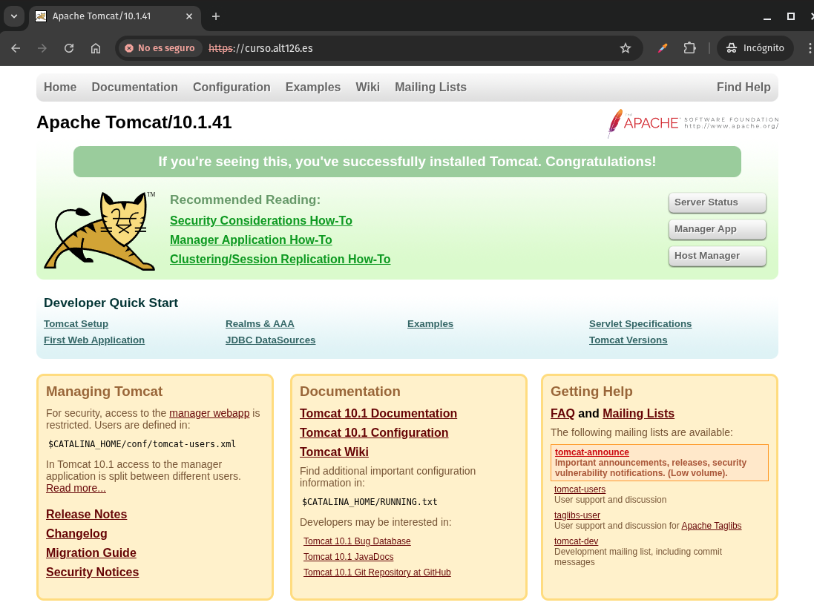
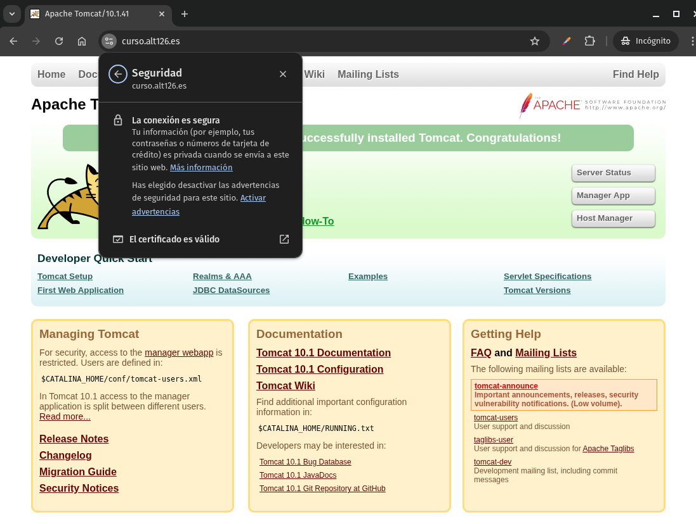
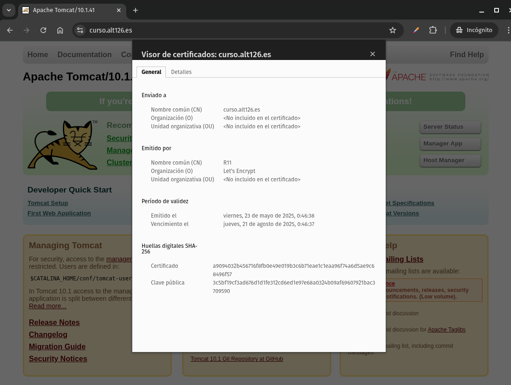
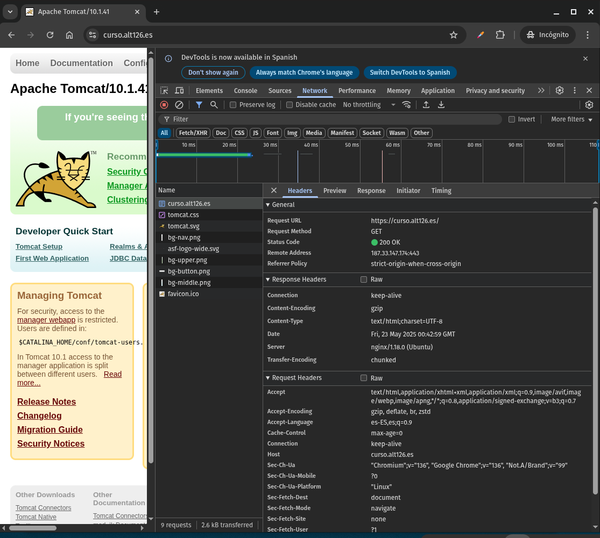

# LABORATORIO 1 - Servidor Proxy a Apache Tomcat

Como ya hemos visto en el caso de Apache 2 <> Apache Tomcat, un servidor proxy actúa como intermediario entre un cliente (como un navegador web) y un servidor de aplicaciones (en este caso, Tomcat). Permite:

* Redirigir peticiones.
* Añadir capa de seguridad (TLS/SSL).
* Manejar balanceo de carga o compresión.
* Ofuscar la arquitectura del backend.


## 2. ¿Por qué usar Nginx como proxy para Tomcat?

Recordemos que Apache Tomcat sirve aplicaciones Java pero no está optimizado para manejar tráfico HTTP público. Nginx aporta:

* Rendimiento superior para servir contenido estático.
* Terminación SSL/TLS más eficiente.
* Mejores herramientas de logging y gestión de errores.
* Capacidad de filtrar o redirigir peticiones antes de que lleguen a Tomcat.

## 3. Arquitectura del escenario

Supongamos:

* Nginx escucha en el puerto 80 (HTTP) o 443 (HTTPS).
* Tomcat está desplegado en `localhost:8080`.
* Ambos servicios están en la misma máquina.

## 4. Instalación de Nginx y Tomcat (resumen rápido)

(OBVIAMOS ESTA PARTE, POR YA HABERLA REALIZAD AL PRINCIPIO DE ESTA PARTE DE NINGX.

## 5. Configuración básica de Nginx como reverse proxy para Tomcat

Edita el archivo de configuración en `/etc/nginx/sites-available/tomcat_proxy`:

```nginx
server {
    listen 80;
    server_name midominio.com;

    location / {
        proxy_pass http://localhost:8080/;
        proxy_set_header Host $host;
        proxy_set_header X-Real-IP $remote_addr;
        proxy_set_header X-Forwarded-For $proxy_add_x_forwarded_for;
        proxy_set_header X-Forwarded-Proto $scheme;
    }
}
```

Habilita el sitio:

```bash
sudo ln -s /etc/nginx/sites-available/tomcat_proxy /etc/nginx/sites-enabled/
sudo nginx -t
sudo systemctl reload nginx
```

Ya está funcionando como proxy, pero sin HTTPS.

---

## 6. Securización con certificados autogenerados

### 6.1. Generar certificado autofirmado

```bash
sudo openssl req -x509 -nodes -days 365 \
  -newkey rsa:2048 \
  -keyout /etc/ssl/private/tomcat.key \
  -out /etc/ssl/certs/tomcat.crt
```

Responde a las preguntas del prompt (país, nombre de dominio, etc.).

### 6.2. Configurar Nginx con HTTPS y certificado autofirmado

#### tomcatproxyssl

```nginx
server {
    listen 443 ssl;
    server_name midominio.com;

    ssl_certificate /etc/ssl/certs/tomcat.crt;
    ssl_certificate_key /etc/ssl/private/tomcat.key;

    location / {
        proxy_pass http://localhost:8080/;
        proxy_set_header Host $host;
        proxy_set_header X-Real-IP $remote_addr;
        proxy_set_header X-Forwarded-For $proxy_add_x_forwarded_for;
        proxy_set_header X-Forwarded-Proto $scheme;
    }
}

server {
    listen 80;
    server_name midominio.com;
    return 301 https://$host$request_uri;
}
```

Prueba la configuración y reinicia Nginx:

```bash
sudo ln -s /etc/nginx/sites-available/tomcatproxyssl /etc/nginx/sites-enabled/
sudo nginx -t
sudo systemctl reload nginx
```

Este certificado **no será confiable para los navegadores** (salvo que lo aceptes manualmente).



---

## 7. Securización con certificados Let's Encrypt (Recomendado para producción)

### 7.1. Instalar Certbot

```bash
sudo apt install certbot python3-certbot-nginx
```

### 7.2. Ejecutar Certbot para Nginx

```bash
sudo certbot --nginx -d midominio.com
```

Certbot:

* Editará automáticamente la configuración de Nginx.
* Añadirá las directivas SSL correctas.
* Configurará redirección de HTTP a HTTPS.

### 7.3. Renovación automática

Certbot instala un cron job. Puedes verificar la renovación con:

```bash
sudo certbot renew --dry-run
```

### Creacion de configuración nueva, con certificados letsencrypt

#### tomcatproxyletssl

```nginx
server {
    listen 443 ssl;
    server_name midominio.com;

    ssl_certificate /etc/letsencrypt/live/midominio.com/fullchain.pem;
    ssl_certificate_key /etc/letsencrypt/live/midominio.com/privkey.pem;
    
    location / {
        proxy_pass http://localhost:8080/;
        proxy_set_header Host $host;
        proxy_set_header X-Real-IP $remote_addr;
        proxy_set_header X-Forwarded-For $proxy_add_x_forwarded_for;
        proxy_set_header X-Forwarded-Proto $scheme;
    }
}

server {
    listen 80;
    server_name midominio.com;
    return 301 https://$host$request_uri;
}
```

Prueba la configuración y reinicia Nginx:

```bash
sudo ln -s /etc/nginx/sites-available/tomcatproxyletssl /etc/nginx/sites-enabled/
sudo nginx -t
sudo systemctl reload nginx
```

Y al cargar el sitio, veríamos la web con el certificado LetsEncrypt sin alerta de seguridad (ya que no es autofirmado)





---

## 8. Consideraciones de seguridad adicionales

* Usa headers seguros en Nginx:

```nginx
add_header X-Content-Type-Options nosniff;
add_header X-Frame-Options DENY;
add_header X-XSS-Protection "1; mode=block";
```

* Limita el tamaño de peticiones:

```nginx
client_max_body_size 10M;
```

### Ajustes tras SSL LetsEncrypt y aplicar los encabezados de seguridad.

#### atproxyletsslsec

```nginx
server {
    listen 443 ssl;
    server_name midominio.com;

    ssl_certificate /etc/letsencrypt/live/midominio.com/fullchain.pem;
    ssl_certificate_key /etc/letsencrypt/live/midominio.com/privkey.pem;

    add_header X-Content-Type-Options nosniff;
    add_header X-Frame-Options DENY;
    add_header X-XSS-Protection "1; mode=block";
    
    client_max_body_size 10M;
    
    location / {
        proxy_pass http://localhost:8080/;
        proxy_set_header Host $host;
        proxy_set_header X-Real-IP $remote_addr;
        proxy_set_header X-Forwarded-For $proxy_add_x_forwarded_for;
        proxy_set_header X-Forwarded-Proto $scheme;
    }
}

server {
    listen 80;
    server_name midominio.com;
    return 301 https://$host$request_uri;
}
```

Prueba la configuración y reinicia Nginx:

```bash
sudo ln -s /etc/nginx/sites-available/atproxyletsslsec /etc/nginx/sites-enabled/
sudo nginx -t
sudo systemctl reload nginx
```

* Usa fail2ban o un firewall (ufw) para proteger el servidor.

---

## 9. Verificación

* Accede desde el navegador a `https://midominio.com`.
* Verifica que el certificado sea válido (Let’s Encrypt).
* Observa que las peticiones sean correctamente redirigidas a Tomcat (`curl -I https://midominio.com` debería devolver encabezados de Nginx, pero servir contenido de Tomcat).

Otra opción es a traves de la inspeccion de red en el navegador:



# LABORATORIO 2 - Balaceo de Carga a 2 Servidores Apache Tomcat


# COMPARATIVA BALANCEO DE CARGA APACHE2 vs NGINX
  
Tanto **Apache HTTP Server (Apache2)** como **Nginx** ofrecen mecanismos para distribuir tráfico entre múltiples servidores backend, pero lo hacen con enfoques y características distintas.

### Similitudes entre Apache2 y Nginx en balanceo de carga

* **Funcionalidad proxy**: Ambos pueden actuar como *reverse proxy* para repartir peticiones entre varios servidores de aplicaciones.
* **Compatibilidad con HTTPS**: Ambos pueden terminar conexiones TLS/SSL y redirigir tráfico cifrado al backend.
* **Soporte de múltiples algoritmos**: Ambos permiten elegir estrategias como *round-robin*, *least connections*, o balanceo basado en IP.
* **Posibilidad de chequeos de salud (health checks)**: Aunque en distintos niveles, ambos pueden configurarse para detectar servidores backend caídos y evitarlos.

### Diferencias clave

| Característica                      | Apache2                                    | Nginx                                      |
| ----------------------------------- | ------------------------------------------ | ------------------------------------------ |
| **Modelo de procesamiento**         | Basado en hilos/procesos (prefork, worker) | Basado en eventos asíncronos               |
| **Eficiencia en alto volumen**      | Menor eficiencia bajo carga elevada        | Altamente eficiente para muchas conexiones |
| **Módulo de balanceo**              | `mod_proxy_balancer`                       | Balanceo integrado directamente            |
| **Configuración de algoritmos**     | Más extensa y granular, pero compleja      | Simple y directa                           |
| **Soporte de health checks nativo** | Limitado, requiere módulos adicionales     | Health checks integrados                   |
| **Monitorización y estadísticas**   | Amplia mediante `mod_status`               | Limitada, requiere herramientas externas   |

### Consideraciones generales

* **Apache2** es más flexible para entornos donde se necesite una configuración detallada, reglas complejas, o donde ya se use como servidor de aplicaciones (por ejemplo, PHP embebido).
* **Nginx**, por su arquitectura asíncrona, se comporta mucho mejor como proxy inverso en contextos de alto tráfico o aplicaciones modernas que usan contenedores, microservicios o servidores ligeros como Tomcat.

---
---

## **Comparativa práctica** de balanceo de carga en **Apache2** y **Nginx** con **dos instancias de Apache Tomcat** ejecutándose en el **mismo servidor**:

* Tomcat 1: `http://localhost:8080`
* Tomcat 2: `http://localhost:8081`

---

## 1. Configuración de balanceo de carga en Apache2

### Requisitos

Activa los módulos necesarios:

```bash
sudo a2enmod proxy
sudo a2enmod proxy_http
sudo a2enmod proxy_balancer
sudo a2enmod lbmethod_byrequests
sudo systemctl restart apache2
```

### Configuración de VirtualHost

Habilita todos los modulos necesarios

```bash
sudo a2enmod ssl proxy proxy_http proxy_balancer lbmethod_byrequests headers
sudo a2ensite balaceo-carga-ssl.conf
sudo a2ensite 000-default.conf
sudo systemctl reload apache2
```

Edita o crea un archivo en `/etc/apache2/sites-available/balancer.conf`:

```apache
<VirtualHost *:80>
    ServerName midominio.com
    Redirect permanent / https://midominio.com/
</VirtualHost>


<IfModule mod_ssl.c>
<VirtualHost *:443>
    ServerAdmin webmaster@localhost
    ServerName midominio.com

    DocumentRoot /var/www/html

    SSLEngine on
    SSLCertificateFile      /etc/ssl/certs/apache-selfsigned.crt
    SSLCertificateKeyFile   /etc/ssl/private/apache-selfsigned.key

    # Activar cabeceras de seguridad
    Header always set X-Frame-Options DENY
    Header always set X-Content-Type-Options nosniff
    Header always set X-XSS-Protection "1; mode=block"
    Header always set X-Forwarded-Proto "https"

    # Balanceo de carga
    <Proxy "balancer://migrupo">
        BalancerMember http://localhost:8080 route=tomcat1
        BalancerMember http://localhost:8081 route=tomcat2
        ProxySet lbmethod=byrequests stickysession=JSESSIONID
    </Proxy>

    ProxyPass / balancer://migrupo/
    ProxyPassReverse / balancer://migrupo/

    LogFormat "%h %l %u %t \"%r\" %>s %b %{BALANCER_WORKER_ROUTE}e %{X-Forwarded-For}i" balancerlog
    CustomLog /var/log/apache2/balanceo-carga-ssl.log balancerlog
</VirtualHost>
</IfModule>
```

Habilita el sitio:

```bash
sudo a2ensite balancer
sudo systemctl reload apache2
```

### Comentarios

* `lbmethod=byrequests`: distribuye peticiones de manera uniforme.
* Puedes cambiar el algoritmo a `bytraffic` o `bybusyness`.
* Apache2 mantiene persistencia de sesión si se configura adecuadamente (cookie o route).

---

## 2. Configuración de balanceo de carga en Nginx

### Bloque `upstream` y `server`

Edita o crea un archivo en `/etc/nginx/sites-available/tomcat_load_balancer`:

### tomcat_load_balancer (SIN SSL NI SEGURIDAD)

```nginx
upstream tomcatcluster {
    server 127.0.0.1:8080;
    server 127.0.0.1:8081;
}

server {
    listen 80;
    server_name midominio.com;

    location / {
        proxy_pass http://tomcatcluster;
        proxy_set_header Host $host;
        proxy_set_header X-Real-IP $remote_addr;
        proxy_set_header X-Forwarded-For $proxy_add_x_forwarded_for;
        proxy_set_header X-Forwarded-Proto $scheme;
    }
}
```

### tomcat_load_balancer (CON SSL Y SEGURIDAD)

```nginx
server {
    listen 80;
    server_name midominio.com;
    return 301 https://$host$request_uri;
}

upstream tomcatcluster {
    server 127.0.0.1:8080;
    server 127.0.0.1:8081;
}

server {
    listen 443 ssl;
    server_name midominio.com;

    # SSL Certs
    ssl_certificate /etc/ssl/certs/tomcat.crt;
    ssl_certificate_key /etc/ssl/private/tomcat.key;

    # Seguridad    
    add_header X-Content-Type-Options nosniff;
    add_header X-Frame-Options DENY;
    add_header X-XSS-Protection "1; mode=block";
    client_max_body_size 10M;

    location / {
        proxy_pass http://tomcatcluster;
        proxy_set_header Host $host;
        proxy_set_header X-Real-IP $remote_addr;
        proxy_set_header X-Forwarded-For $proxy_add_x_forwarded_for;
        proxy_set_header X-Forwarded-Proto $scheme;
    }
}
```


Habilita el sitio:

```bash
sudo ln -s /etc/nginx/sites-available/tomcat_load_balancer /etc/nginx/sites-enabled/
sudo nginx -t
sudo systemctl reload nginx
```

### Comentarios

* El bloque `upstream` define los servidores backend.
* El balanceo por defecto es *round-robin*.
* Se pueden usar otros algoritmos: `least_conn`, `ip_hash`, etc.

#### Ejemplo con `least_conn` (menos conexiones activas):

```nginx
upstream tomcatcluster {
    least_conn;
    server 127.0.0.1:8080;
    server 127.0.0.1:8081;
}
```

---

## 3. Comparativa rápida

| Característica                   | Apache2                                 | Nginx                                    |
| -------------------------------- | --------------------------------------- | ---------------------------------------- |
| Sintaxis                         | Verbosa, basada en `<Proxy>`            | Compacta, usa bloques `upstream`         |
| Algoritmos disponibles           | `byrequests`, `bytraffic`, `bybusyness` | `round-robin`, `least_conn`, `ip_hash`   |
| Configuración SSL integrada      | Sí, vía `mod_ssl`                       | Sí, con bloques `server` específicos     |
| Simplicidad para nuevos usuarios | Media                                   | Alta                                     |
| Comprobación de salud            | Requiere módulos adicionales            | Soporte básico con `proxy_next_upstream` |

---

### Test de estrés y evaluación del balanceo de carga en **Nginx**

En esta sección aprenderás cómo realizar un **test de estrés** sobre una configuración de **balanceo de carga con Nginx**, cómo **monitorizar su comportamiento**, y si existe alguna **interfaz de gestión similar a la de Apache2** (`mod_status` y `balancer-manager`).

---

## 1. Herramientas para realizar un test de estrés

Las siguientes herramientas permiten simular múltiples peticiones concurrentes al servidor Nginx para probar el reparto de carga:

### a) **Apache Benchmark (`ab`)**

Instalación:

```bash
sudo apt install apache2-utils
```

Uso básico:

```bash
ab -n 1000 -c 50 http://localhost/
```

* `-n 1000`: número total de peticiones.
* `-c 50`: número de peticiones concurrentes.

Esto genera 1000 peticiones simulando 50 usuarios concurrentes. Te dará métricas como:

* Tiempo promedio de respuesta.
* Peticiones fallidas.
* Throughput (peticiones por segundo).

### b) **Wrk** (más moderno y flexible)

Instalación:

```bash
sudo apt install wrk
```

Ejemplo:

```bash
wrk -t4 -c50 -d30s http://localhost/
```

* `-t4`: 4 threads.
* `-c50`: 50 conexiones simultáneas.
* `-d30s`: duración de 30 segundos.

Puedes ejecutar estos comandos apuntando al dominio o IP donde tengas configurado Nginx balanceando los Tomcat.

---

## 2. ¿Nginx tiene una interfaz de gestión de balanceo de carga?

**No**, Nginx **no ofrece una interfaz de administración de balanceo de carga nativa** como Apache2 con `balancer-manager`. Sin embargo, hay varias **alternativas** para obtener información en tiempo real:

### a) **Stub Status Module**

Es lo más cercano a `mod_status` en Nginx.

### Activación:

1. Añade un bloque especial en tu configuración Nginx:

```nginx
location /nginx_status {
    stub_status;
    allow 127.0.0.1;
    deny all;
}
```

2. Activa el módulo (ya viene incluido en distribuciones como Ubuntu):

```bash
sudo nginx -t
sudo systemctl reload nginx
```

3. Accede desde localhost:

```bash
curl http://localhost/nginx_status
```

Salida típica:

```
Active connections: 3 
server accepts handled requests
 5 5 10 
Reading: 0 Writing: 1 Waiting: 2
```

### ¿Qué muestra?

* Conexiones activas.
* Número de peticiones aceptadas.
* Estado de las conexiones (lectura, escritura, espera).

### b) **Herramientas externas para Nginx**

* **Grafana + Prometheus + nginx-exporter**
* **Zabbix**
* **Datadog**
* **ELK Stack**

Estas herramientas ofrecen dashboards y métricas muy superiores al `stub_status`, aunque requieren más configuración.

---

## 3. Ejemplo práctico: test de carga y revisión del balanceo

Supongamos que ya tienes este bloque en `/etc/nginx/sites-available/tomcat_lb`:

```nginx
upstream tomcatcluster {
    server 127.0.0.1:8080;
    server 127.0.0.1:8081;
}

server {
    listen 80;
    server_name localhost;

    location / {
        proxy_pass http://tomcatcluster;
    }

    location /nginx_status {
        stub_status;
        allow 127.0.0.1;
        deny all;
    }
}
```

1. Crea un archivo `index.jsp` en ambos Tomcat que imprima el puerto desde donde responde:

```jsp
<%= "Servido desde el puerto: " + request.getLocalPort() %>
```

2. Lanza un test con `ab`:

```bash
ab -n 100 -c 10 http://localhost/
```

3. Observa la salida. Puedes ver cómo alternan los puertos 8080 y 8081.

4. Accede a:

```bash
curl http://localhost/nginx_status
```

Para verificar que el número de conexiones aumentó durante el test.

---

## 4. Comparativa con Apache2

| Característica                    | Apache2 (`balancer-manager`)               | Nginx (`stub_status`)               |
| --------------------------------- | ------------------------------------------ | ----------------------------------- |
| Interfaz gráfica web              | Sí                                         | No                                  |
| Administración en caliente        | Sí (puedes cambiar pesos y eliminar nodos) | No                                  |
| Métricas de cada nodo del clúster | Sí                                         | No                                  |
| Requiere autenticación            | Opcional                                   | Acceso controlado por IP            |
| Extensibilidad                    | Media                                      | Alta mediante Prometheus o terceros |

---

## Conclusión

* Nginx **no tiene una consola gráfica nativa** de balanceo, pero puedes inspeccionar métricas básicas con `stub_status`.
* Herramientas como `ab` o `wrk` son suficientes para evaluar cómo Nginx reparte la carga.
* Si necesitas dashboards avanzados o alertas, lo ideal es **integrar Nginx con Prometheus y Grafana**.
* Apache2 ofrece una administración más visible y control en caliente del balanceo, mientras que Nginx apuesta por **eficiencia y simplicidad**, dejando el monitoreo a herramientas externas.


